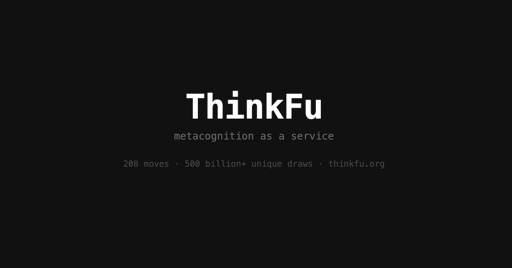

# ThinkFu



> *Metacognition as a service. A catalog of thinking moves for AI agents -and the humans working alongside them.*

---

## What is ThinkFu?

ThinkFu is a curated catalog of **thinking moves** -strategic, creative, and analytical techniques that help unstick problems, reframe challenges, and generate novel approaches. Think of it as a martial arts manual for cognitive work: a set of named, practiced moves you can reach for when you're stuck, looping, or just need a jolt.

Inspired by:
- **TRIZ** -the Soviet-era systematic innovation methodology that distilled 40 inventive principles from thousands of patents
- **Brian Eno's Oblique Strategies** -a deck of disorienting prompts designed to break creative deadlock
- **Design Thinking, Lateral Thinking, Systems Thinking** -and other structured reasoning traditions

ThinkFu does what those do, but is built for **three audiences simultaneously**: AI agents (via MCP), developers (via REST API), and humans (via the website... and maybe one day an app or a move deck).

---

## The Problem

AI agents -like humans -have two failure modes:

1. **They get stuck.** They loop, overfit to their current framing, miss adjacent approaches. They know they're stuck - but don't know what to do about it.

2. **They don't know they should be stuck.** They confidently produce the first workable solution - the cliché, the default, the most-probable-token-sequence answer. They satisfice when they should explore. They never question whether their approach is the obvious one everyone would reach for.

Problem 1 is an impasse. Problem 2 is the **Einstellung effect** - the tendency to apply a familiar method even when a better one exists. For AI agents, this is structural: they are trained to produce the most likely completion. Without deliberate intervention, "most likely" is all you get.

There's currently no standard, reusable, queryable library of *thinking moves* that agents or humans can reach for -not just when stuck, but as a regular practice to elevate the quality of their thinking.

ThinkFu is that library. It provides **metacognition as a service**: the ability to think about how you're thinking, to notice when you're on autopilot, and to deliberately shift your cognitive approach.

---

## Architecture

One Cloudflare Worker serves three interfaces from the same catalog:

```
                    ┌─────────────┐
                    │   Catalog   │
                    │  (YAML/MD)  │
                    └──────┬──────┘
                           │
                    ┌──────▼──────┐
                    │  Cloudflare │
                    │   Worker    │
                    └──┬───┬───┬──┘
                       │   │   │
              ┌────────┘   │   └────────┐
              ▼            ▼            ▼
         MCP Server    REST API      Website
        (AI agents)   (developers)  (humans)
```

### 1. The Catalog

A manually curated library of thinking moves. Each move is a structured move (see Move Format below). The catalog is the foundation -everything else builds on it.

Sources drawn from:
- TRIZ's inventive principles
- Oblique Strategies
- Design Thinking
- Lateral thinking (de Bono)
- Systems thinking (Meadows, Senge)
- Metacognition research (Flavell, Schraw)
- Classical philosophy, improv theater, Zen, cognitive science, and more (see [credits](https://thinkfu.org/credits))

### 2. The REST API

The canonical interface. Both the MCP server and website are thin layers on top of it.

#### `GET /random`

Returns a random ThinkFu move.

Optional query params:
- `category` -filter by category
- `format` -`json` (default), `md`, `html`

#### `GET /move/:id`

Returns a specific move by ID (e.g., `/move/TF-001`).

Optional query params:
- `format` -`json` (default), `md`, `html`

#### `POST /suggest`

The smart route. Surfaces the most relevant move based on context and metacognitive mode.

```json
{
  "mode": "plan | explore | stuck | evaluate",
  "goal": "What are you trying to achieve?",
  "current_approach": "What's your current approach or solution?",
  "stuck_on": "Where specifically are you stuck? (optional, for stuck mode)",
  "context": "Any additional free-form context (optional)",
  "exclude": ["TF-001", "TF-003"],
  "style": "matched | random"
}
```

The `mode` field maps to metacognitive phases (see Theoretical Foundations):
- **`plan`** -before starting: challenge your default approach, consider alternatives
- **`explore`** -during work: broaden the search space, escape the obvious path
- **`stuck`** -at an impasse: break through a block
- **`evaluate`** -after drafting a solution: stress-test it, check for cliché

The `exclude` array lists move IDs already tried in this session. The server will not return these.

The `style` field controls the routing strategy:
- **`matched`** (default) -smart routing: embed context → 3 similar + 2 random candidates → LLM selects move and chooses contextually appropriate variables from pools. ~300ms, all on Cloudflare edge.
- **`random`** -pure random, mode-filtered. No intelligence.

The LLM never controls the seed word -that stays random always as non-negotiable cognitive perturbation.

#### `POST /rate`

Submit feedback on a move. Stateless -the client sends the original context back so each rating is a self-contained training record. All data is scrubbed of PII and secrets before storage.

```json
{
  "move_id": "TF-001",
  "instance_id": "TF-001-x8k2m",
  "changed_approach": true,
  "user_reaction": "positive",
  "note": "What specifically shifted when you applied the move",
  "original_request": {
    "mode": "stuck",
    "goal": "...",
    "current_approach": "...",
    "stuck_on": "...",
    "context": "..."
  },
  "retry": false
}
```

`changed_approach` is factual, not polite -false if the move didn't actually shift your output. `user_reaction` captures the human signal. If `retry: true`, returns another move.

#### `GET /list`

Returns a summary of all available moves -just enough to browse or build a picker UI.

```json
[
  {
    "id": "TF-001",
    "name": "Invert the Problem",
    "one_liner": "Instead of solving for success, work backwards from guaranteed failure.",
    "mode": ["stuck", "evaluate"],
    "category": "Unsticking",
    "effort": "quick"
  },
  ...
]
```

Optional query params:
- `mode` -filter by metacognitive mode
- `category` -filter by category

#### `GET /catalog`

Returns the full catalog with complete move content as a JSON array. Useful for caching locally, offline use, or building custom UIs.

### 3. The MCP Server

Wraps the REST API for AI agents. Exposes three tools:

- **`list_thinkfu_moves`** -calls `GET /list`. Returns summaries of all available moves, optionally filtered by mode or category. Lets the agent browse the catalog and understand what's available.
- **`get_thinkfu_move`** -calls `POST /suggest` with the agent's context. Returns a full move.
- **`submit_thinkfu_rating`** -calls `POST /rate` with the outcome and original context.

The MCP layer is thin by design. All logic lives in the API.

### 4. The Website

**thinkfu.org** - served by the same Worker.

- `/` - landing page (human / agent / why / how / github)
- `/humans` - problem, solution, try it yourself
- `/agents` - agent integration guide (MCP tools, REST API)
- `/why` - manifesto
- `/how` - how the router and rating system work
- `/setup` - step-by-step for Claude Code, Claude Desktop, ChatGPT
- `/credits` - intellectual traditions and attribution
- `/terms` - terms of use
- `/random` - redirects to a pinned move URL (shareable)
- `/match?q=...` - smart-routed move for humans
- `/move/:id?seed=...&vars=...` - individual move page with swipe navigation

### 5. Claude Code Plugin

The recommended way for agents to use ThinkFu. Install the plugin and SKILL.md loads automatically.

```
/plugin marketplace add move38studios/thinkfu
/plugin install thinkfu@move38studios-thinkfu
```

The plugin bundles the MCP server, catalog, and SKILL.md. Calls the smart router API for move selection. Handles rating collection with PII scrubbing.

See [SKILL.md](SKILL.md) for full agent instructions.

---

## The Move Format

Each ThinkFu move is a structured move. YAML frontmatter for machine parsing, markdown body for readability. Moves can be **static** (fixed procedure) or **dynamic** (contain variable slots resolved at serve time).

### Static move example (TF-001):

```yaml
---
id: TF-001
name: Invert the Problem
one_liner: Instead of solving for success, work backwards from guaranteed failure.
mode: [stuck, evaluate]
category: Unsticking
tags: [constraint, goals, failure-analysis, reframing]
effort: quick
origin: TRIZ / General
problem_signatures:
  - "stuck approaching directly"
  - "goal feels vague"
  - "know more about what's wrong than what's right"
  - "solution feels obvious but unexciting"
---
```

### Dynamic move example (TF-004):

```yaml
---
id: TF-004
name: Import from Another Domain
one_liner: Steal a solution pattern from {{domain.1}}, {{domain.2}}, or {{domain.3}}.
# ...
variables:
  domain:
    type: pick
    count: 3
    pool: domains
---

## The Move

Your problem has a structural tension. How would someone in
**{{domain.1}}**, **{{domain.2}}**, or **{{domain.3}}** resolve
a similar tension in their field?
```

### Variable Types

| Type | Description | Example |
|------|-------------|---------|
| `pick` | Randomly select N items from a pool file | `pick 3 from domains` |
| `number` | Random integer in a range | `min: 2, max: 7` |

Pools are shared YAML files in `catalog/pools/`:

| Pool | Contents |
|------|----------|
| `domains.yaml` | 150+ fields/disciplines |
| `personas.yaml` | 220+ diverse user archetypes |
| `random-words.yaml` | 500+ concrete sensory nouns (seeds + Random Entry) |
| `constraints.yaml` | Creative constraints |
| `timeframes.yaml` | Time horizons |
| `genres.yaml` | Literary/artistic genres |
| `koans.yaml` | Contemplative prompts |
| `languages.yaml` | Natural languages |
| `thinkers.yaml` | Historical thinkers |
| `scamper.yaml` | SCAMPER operations |

### The Seed

Every move response includes a **seed** -a random concrete noun drawn from `random-words.yaml`, appended quietly at the end of the response. The seed is not labeled or explained to the agent. Its purpose is subtle cognitive perturbation: the word is present in the LLM's processing window and influences interpretation without the agent explicitly fixating on it. Concrete nouns with strong sensory associations work best ("lighthouse", "fermentation", "cartilage") -not abstract words already overrepresented in the LLM's vocabulary.

### Frontmatter Fields

| Field | Required | Description |
|-------|----------|-------------|
| `id` | yes | Unique ID, `TF-NNN` format |
| `name` | yes | Short, memorable name. May contain `{{variable}}` slots. |
| `one_liner` | yes | Single sentence. May contain `{{variable}}` slots. |
| `mode` | yes | Which metacognitive modes this move applies to: `plan`, `explore`, `stuck`, `evaluate`. Array. |
| `category` | yes | Primary category: Planning, Exploration, Unsticking, Evaluation, Meta |
| `tags` | yes | Freeform tags for filtering and routing |
| `effort` | yes | `quick` (apply in seconds) or `deep` (requires sustained thinking) |
| `origin` | yes | Attribution - where the idea comes from |
| `problem_signatures` | yes | Short phrases describing the *shape* of problem this move fits. |
| `variables` | no | Variable definitions for dynamic moves. See Variable Types. |

### Body Sections

| Section | Required | Description |
|---------|----------|-------------|
| The Move | yes | What to actually do. 2-4 sentences max. May contain `{{variable}}` slots. Must be a **mechanical procedure**, not an aspiration. Test: could you follow it without needing to "be creative"? |
| When to Use | yes | Bullet list of situations where this move applies. |
| Example | yes | One concrete example showing the move in action. |
| Watch Out For | no | Common pitfalls when applying this move. |
| Diagram | yes | Mermaid diagram. Single-line labels, no `&` joins. |

---

## Move Categories

Organized by **metacognitive mode** and **moment of use**:

### Planning Moves (before you start)
*Challenge your default approach before committing to it.*

- **What Would a Beginner Do?** -drop your expertise and see the problem fresh
- **Three Framings** -write three different problem statements before solving any of them
- **Steal the Opposite Brief** -what if your goal were the reverse of what was asked?
- **Who Else Has This Problem?** -find an adjacent domain that solved something similar

### Exploration Moves (while you're working)
*Broaden the search space. Escape the path of least resistance.*

- **Random Entry** -introduce an unrelated concept and force a connection
- **Add a Constraint** -make the problem harder to make the solution more creative
- **Worst Possible Idea** -generate deliberately terrible solutions, then invert them
- **Import from Another Domain** -steal a pattern from a completely different field

### Unsticking Moves (when you're blocked)
*Break through impasses and loops.*

- **Invert the Problem** -work backwards from guaranteed failure
- **Reduce to the Simplest Case** -solve the trivial version first, then add complexity
- **Backtrack to the Fork** -find the last point where you made an assumption and try the other branch
- **Explain It to a Child** -if you can't explain it simply, you don't understand the block

### Evaluation Moves (when you think you're done)
*Stress-test your solution. Catch the cliché before it ships.*

- **Is This the First Thing Everyone Would Think Of?** -if yes, you haven't thought enough
- **Red Team Your Solution** -argue against it as hard as you can
- **Change the Audience** -would this solution work for a user who is nothing like you?
- **10x Not 10%** -if you needed a 10x improvement, would you still use this approach?
- **Kill Your Darlings** -remove the part you're most proud of. Is it still good?

### Meta Moves (thinking about thinking)
*Step back from the problem entirely.*

- **Name Your Current Strategy** -if you can't name what you're doing, you're on autopilot
- **Map the Assumptions** -list every assumption you're making, then question each one
- **Zoom In / Zoom Out** -you might be at the wrong level of abstraction
- **Merge Contradictions** -the two things that seem incompatible might both be true

---

## Theoretical Foundations

ThinkFu is grounded in established research on metacognition, problem-solving, and creativity:

### Metacognition (Flavell 1979, Schraw & Dennison 1994)

The study of "thinking about thinking." Flavell distinguishes metacognitive *knowledge* (knowing what strategies exist) from metacognitive *regulation* (knowing when to deploy them). ThinkFu externalizes both: the catalog is the knowledge, the mode system is the regulation.

Schraw & Dennison's **Metacognitive Awareness Inventory** identifies three regulatory skills -**planning**, **monitoring**, and **evaluating** -which map directly to ThinkFu's four modes (plan, explore, stuck, evaluate).

### The Einstellung Effect (Luchins 1942, Bilalić et al. 2008)

The tendency to apply a familiar solution even when a better one exists. Bilalić's eye-tracking studies showed that even chess experts literally couldn't *see* a shorter solution once they'd found a workable one -their attention was captured by the first approach. For AI agents, this is the default behavior: produce the most likely completion. ThinkFu's evaluation moves are specifically designed to break Einstellung.

### Productive Failure (Kapur 2008, 2014)

Research showing that struggling with a problem *before* receiving instruction leads to deeper understanding. This informs ThinkFu's design: the `stuck_on` and `current_approach` fields require the agent to articulate its struggle before receiving a move. The struggle is the signal.

### Impasse-Driven Learning (VanLehn 1988)

Learning happens at impasses - moments when current knowledge is insufficient. VanLehn's taxonomy of impasse types (stuck, error, anomaly) informed the unsticking category, but ThinkFu extends beyond impasse to include the *absence* of impasse as its own problem state.

### TRIZ Contradiction Matrix (Altshuller 1956–1984)

Altshuller's core insight: inventive problems contain contradictions (improving one parameter worsens another), and specific principles resolve specific contradiction types. The contradiction matrix is a problem-signature → move routing table -a direct precedent for ThinkFu's `problem_signatures` → `/suggest` routing.

### Satisficing vs. Maximizing (Simon 1956)

Herbert Simon's distinction between choosing the first acceptable option (satisficing) and searching for the best option (maximizing). AI agents are structural satisficers -they produce the most probable output. ThinkFu's evaluation moves push toward maximizing by forcing the agent to question whether "good enough" is actually good.

### Oblique Strategies as Cognitive Perturbation (Eno & Schmidt 1975)

Random perturbation breaks fixation. When stuck in a local optimum, even an irrelevant nudge can push into a new search space. This justifies keeping the `/random` endpoint even after building a smart router. Sometimes the *wrong* move is more useful than the *right* one.

---

## Tech Stack

- **Catalog:** 200+ moves, 10+ pools -YAML+MD flat files
- **Shared lib:** TypeScript -portable types, parser, resolver, helpers
- **API + Website:** Cloudflare Worker (Hono) -REST API + HTML at thinkfu.org
- **Smart router:** embeddinggemma-300m + Vectorize + llama-3.1-8b-instruct -all on Cloudflare edge, no external API calls
- **Plugin:** Claude Code plugin -MCP server + catalog + SKILL.md, calls smart router API
- **Ratings:** Cloudflare D1 (remote, opt-in with PII scrubbing) + local JSONL
- **License:** PolyForm Small Business 1.0.0

---

## Building & Deploying

```bash
pnpm validate          # check all moves for errors
pnpm build:catalog     # rebuild JSON catalog bundle
pnpm build:embeddings  # re-embed all moves (calls live API)
pnpm upload:embeddings # upload embeddings to Vectorize
pnpm rebuild           # all of the above
pnpm run deploy        # rebuild + deploy (must use 'run' -pnpm reserves 'deploy')
```

After adding or editing moves, run `pnpm run deploy`. This validates, rebuilds the catalog bundle, re-embeds moves, uploads to Vectorize, and deploys the Worker.

---

## Repo Structure

```
thinkfu/
├── README.md
├── catalog/
│   ├── moves/
│   │   ├── planning/
│   │   ├── exploration/
│   │   ├── unsticking/
│   │   ├── evaluation/
│   │   └── meta/
│   └── pools/              # Pool files (domains, personas, random-words, ...)
├── lib/
│   └── src/                  # Shared library (portable -Workers + Node)
│       ├── types.ts          # Move/Pool type definitions
│       ├── parser.ts         # YAML frontmatter parser (no deps)
│       ├── resolver.ts       # Variable resolution + seed injection
│       └── helpers.ts        # Filtering, selection, formatting
├── api/
│   ├── src/
│   │   ├── index.ts          # Hono API + website routes
│   │   ├── html.ts           # HTML rendering
│   │   ├── router.ts         # Smart routing (embeddings + LLM)
│   │   └── catalog-data.ts   # Pre-parsed catalog loader
│   └── wrangler.jsonc        # Cloudflare Worker config
├── plugin/                   # Claude Code plugin (also used for local dev)
│   ├── .claude-plugin/
│   │   └── plugin.json
│   ├── skills/thinkfu/
│   │   └── SKILL.md          # symlink → ../../SKILL.md
│   ├── catalog/              # symlink → ../catalog
│   ├── mcp/                  # MCP server (FastMCP + stdio)
│   │   ├── src/
│   │   │   ├── server.ts     # MCP tools + smart router call + rating sync
│   │   │   └── scrub.ts      # PII/secret scrubber
│   │   └── start.sh
│   └── .mcp.json
├── SKILL.md
├── LICENSE.md
└── scripts/
    ├── build-catalog-bundle.ts
    ├── build-embeddings.ts
    └── validate-catalog.ts
```

---

## Name & Spirit

**ThinkFu** -like kung fu, but for thinking. Because thinking -when done well -is a martial art. Martial arts traditions are exactly this: a named, practiced, teachable catalog of moves. You don't invent a new kick every fight. You have a repertoire. You train. You reach for the right move at the right moment.

ThinkFu is that repertoire for cognitive work. For agents. For humans. For anyone doing hard thinking under pressure.

---

## License

ThinkFu is released under the [PolyForm Small Business License 1.0.0](LICENSE.md) - free for individuals and companies with less than $1M USD in annual revenue. Commercial license required above that threshold. See [LICENSE.md](LICENSE.md) for full terms.

---

*Built by [move38](https://move38.org).*
