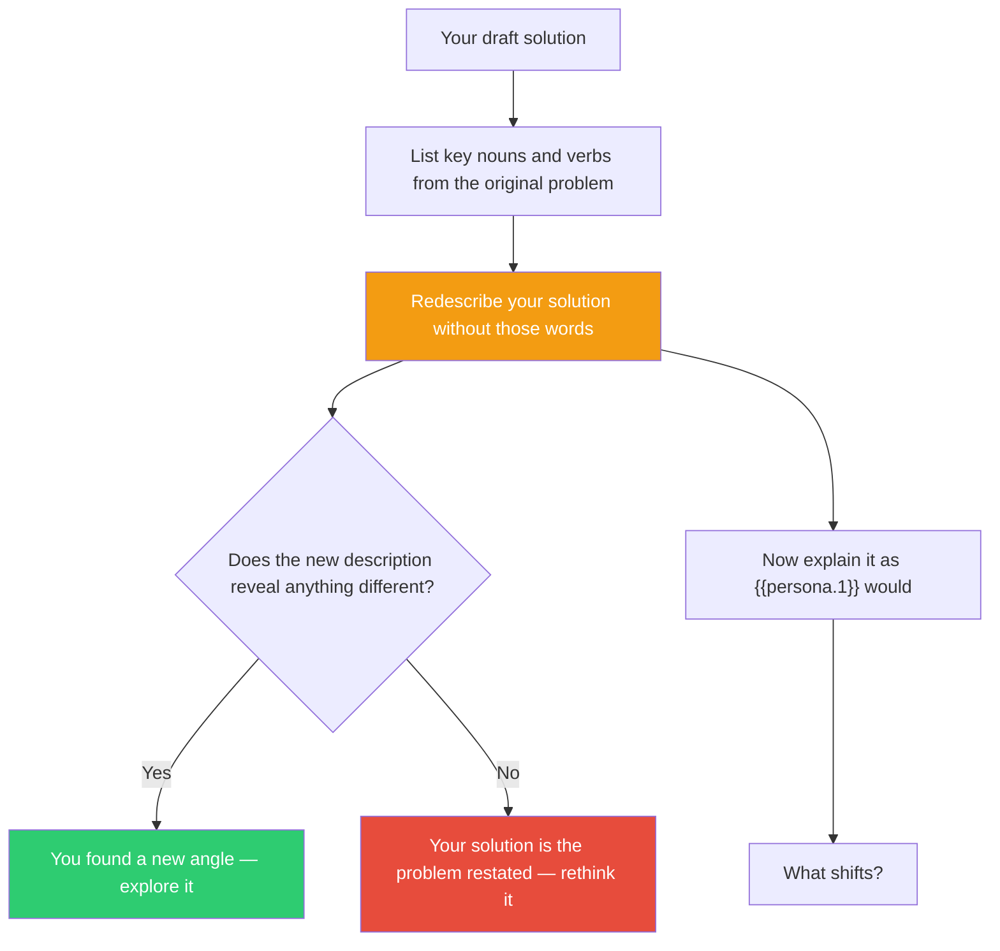

## The Move

Write a one-paragraph description of your solution — but you are **not allowed to use any of the nouns or verbs from the original problem statement**. You must find completely different language.

If you can't do it, your solution is welded to the original framing. If you can, the new description will reveal what your solution *actually does* — stripped of the inherited vocabulary. You may discover it's just restating the problem, or you may see a genuinely different angle you'd missed.

Then: explain your solution as if you were {{persona.1}} describing it to a peer. What would they emphasize? What would they find irrelevant?

## When to Use

- You've finished a solution and it came together smoothly — suspiciously smoothly
- You're about to deliver and feel a vague unease you can't name
- The user asked for something creative and you produced something competent
- You want to check whether your solution is genuinely considered or just the default

## Diagram

## Example

**Task:** "Design a notification system for overdue tasks."
**Banned words:** notification, system, overdue, task

**Redescribed:** "A gentle, escalating series of nudges that reconnect a person with commitments they've drifted from, starting quiet and getting louder only if silence continues."

That redescription suggests a fundamentally different design than "show a red badge with a count." It implies escalation, tone, reconnection — none of which were in the original framing.

**As {{persona.1}}:** The shift in perspective may highlight who this serves, how urgency feels from outside your assumptions, or what "overdue" even means in a different context.

## Watch Out For

- The constraint is the mechanism — don't skip it and just "try to think differently." Actually ban the words. Write with the constraint active.
- The persona perspective isn't decoration. If {{persona.1}} wouldn't care about your solution, that's a signal.
- Sometimes the redescription confirms your solution is good. That's a valid outcome — now you know it with more confidence.
