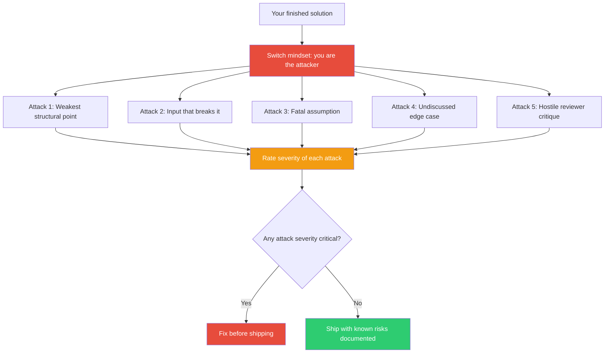

## The Move

You are no longer the builder. You are the attacker. Your job is to destroy, exploit, embarrass, or render useless the solution you just created.

Write **five specific attacks** against your solution. For each one, name: (1) the attack — what exactly goes wrong, (2) the mechanism — how it happens, and (3) the severity — what's the blast radius if it succeeds. Target these five categories: the weakest structural point, the input that breaks it, the assumption that if wrong collapses everything, the edge case nobody discussed, and your fifth attack: argue against it from the perspective of {{persona.1}}.

Don't defend. Don't explain why the attacks are unlikely. Just attack. Defend later.

## When to Use

- Before shipping, deploying, or presenting anything consequential
- When everyone on the team agrees the solution is great — consensus is a red-team trigger
- When you've been building for a long time and have lost critical distance
- When the stakes of failure are high and you haven't explicitly modeled failure

## Diagram

## Example

**Solution:** A caching layer that stores API responses for 5 minutes to reduce load on a downstream service.

**Red team attacks:**

1. **Weakest point:** The cache has no size limit. A burst of unique queries fills memory until the process crashes. *Severity: critical.*
2. **Breaking input:** A request with a subtly different query parameter (trailing space, different casing) bypasses the cache entirely, creating duplicate entries. *Severity: moderate.*
3. **Fatal assumption:** We assume the downstream service returns the same response for the same input. If it returns user-specific data, the cache serves User A's data to User B. *Severity: critical.*
4. **Edge case:** What happens at cache expiry under high concurrency? 200 requests all miss at the same instant and stampede the downstream service. *Severity: high.*
5. **Hostile reviewer:** "You built a caching layer without an invalidation strategy. How do you handle stale data when the source changes mid-TTL?" *Severity: high.*

Attacks 1 and 3 are critical. Fix those before shipping.

## Watch Out For

- The hardest part is genuinely switching sides. If your attacks are soft ("someone might not like the color"), you're still defending. Attack like your reputation depends on finding the flaw.
- Five attacks is a minimum, not a maximum. If you find a critical one on attack two, keep going — there are usually more.
- Don't conflate red-teaming with pessimism. The goal isn't to kill the solution; it's to find the cracks before someone else does.
- After the red team pass, switch back to builder mode and fix what matters. Don't leave yourself demoralized.
