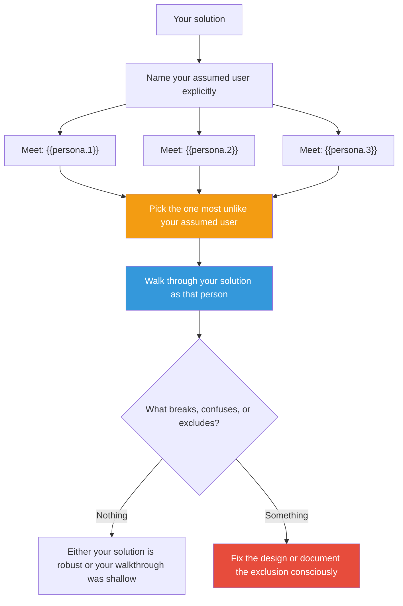

## The Move

Your solution was designed for someone. Name that someone explicitly. Now meet three different people: **{{persona.1}}**, **{{persona.2}}**, and **{{persona.3}}**.

Pick the person **most unlike** your assumed user. Walk through your solution step by step from their perspective. What do they see first? Where do they get confused? What do they not have (knowledge, access, patience, ability) that your solution silently requires? What part of your design is invisible to them — or actively hostile?

Write down what breaks. Then decide: is that breakage acceptable, or does it reveal a flaw in the design itself?

## When to Use

- Your solution was designed quickly and you never explicitly named the audience
- You're building for "everyone" — which usually means "people like the builder"
- The solution works perfectly for the happy-path user and you haven't checked anyone else
- You want to find accessibility, usability, or comprehension gaps before launch

## Diagram

## Example

**Solution:** An onboarding flow for a developer tool. It walks new users through creating an API key, configuring a YAML file, and running a CLI command.

**Assumed user:** Mid-career backend developer comfortable with terminals.

**Changed audience:** {{persona.3}} — say this resolves to "a grandmother who just got her first smartphone."

**Walkthrough:** She doesn't know what an API key is. She doesn't have a terminal. YAML means nothing. The word "configure" is a wall. Every single step assumes prior knowledge that she doesn't have.

**What this reveals:** The onboarding isn't "simple" — it's simple *for experts*. If the product truly wants broader adoption, the onboarding needs a zero-jargon path. If the product is only for developers, that's fine — but make that choice explicitly rather than letting it happen by default.

## Watch Out For

- Don't patronize the alternate persona. A grandmother isn't stupid; she has different knowledge. A blind engineer isn't less capable; they have different tools. Respect the persona's intelligence while acknowledging their context.
- If nothing breaks for any persona, either your solution is genuinely universal (rare) or you didn't take the walkthrough seriously. Try harder.
- This move doesn't mean you must design for everyone. It means you should *know* who you're excluding and *choose* that consciously.
- The most valuable output is often the thing your solution silently requires but never states.
