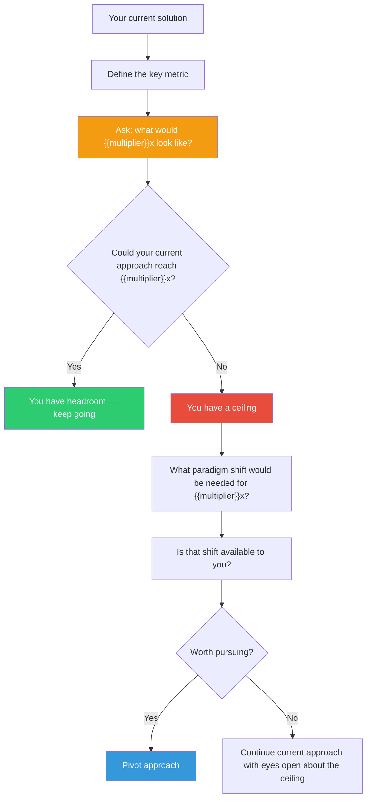

## The Move

Take your current solution and ask: **if I needed this to be {{multiplier}}x better** ({{multiplier}}x faster, {{multiplier}}x cheaper, {{multiplier}}x simpler, {{multiplier}}x more impactful), would I still use this approach?

A 10% improvement lets you optimize within the current paradigm — tune parameters, shave milliseconds, tighten copy. A {{multiplier}}x improvement forces you to question the paradigm itself. You usually can't get {{multiplier}}x by doing the same thing harder. You have to do a different thing entirely.

You don't need to actually *achieve* {{multiplier}}x. The point is to discover whether your current approach has a **ceiling** — and whether that ceiling is lower than you think.

## When to Use

- You're refining and polishing a solution that works but doesn't excite
- You're in an optimization loop — making things 5%, 8%, 12% better
- A competitor, new technology, or market shift could make your approach obsolete
- You want to check whether you're climbing the right hill or just climbing efficiently

## Diagram

## Example

**Solution:** You've built a support chatbot that resolves 30% of tickets automatically. You're tuning prompts and adding FAQ entries to push it to 35%.

**The 10x question:** What would 300% resolution look like — resolving *every* ticket automatically?

**What it reveals:** You can't get there by adding more FAQ entries. The ceiling is the architecture: the bot can only handle questions it's been explicitly programmed for. 10x would require the bot to understand the product deeply enough to diagnose novel problems — a fundamentally different system (retrieval-augmented generation over internal docs, tool-use for account lookups, etc.).

**The decision:** Maybe you don't build the 10x version today. But now you know your current approach tops out around 40-50%, and you can make an informed choice: keep optimizing for near-term gains while planning the architectural shift, rather than being surprised by the ceiling later.

## Watch Out For

- This move can paralyze if you take it too literally. The goal is awareness, not abandonment. Most days you ship the 10% improvement. But you should know where the ceiling is.
- "10x" is a thought experiment, not a requirement. If your domain doesn't have a meaningful 10x, pick a different multiplier — 3x or 5x still works.
- Don't use this to dismiss solid, incremental work. Incremental work compounds. The danger is only when you don't realize you're on a curve that flattens.
- Sometimes the 10x answer is "do less, not more." Removing steps often outperforms adding features.
