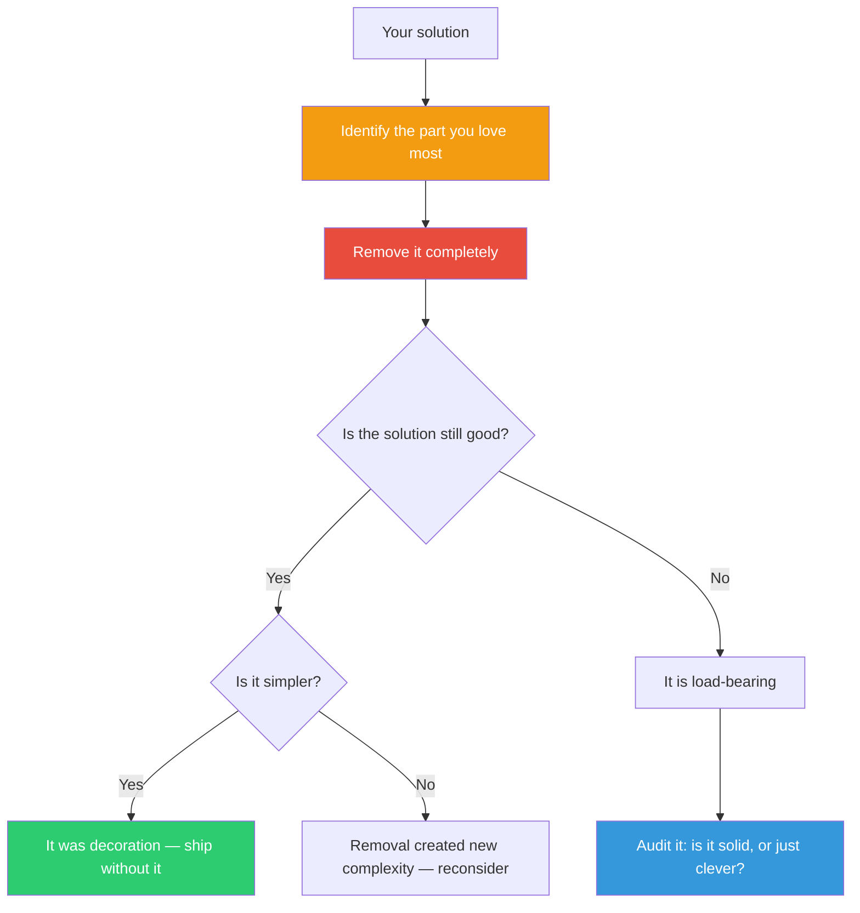

## The Move

Identify the part of your solution you are **most proud of** — the clever abstraction, the elegant pattern, the feature you enjoyed building, the sentence you think is perfect.

Now remove it entirely. Cross it out. Delete the file. Comment out the function.

Ask two questions: (1) Is the solution still good without it? (2) Is the solution *simpler* without it?

If yes to both: your darling was decoration. Ship without it. If the solution collapses: you've found the load-bearing element. Make sure it's *solid*, not just *clever* — cleverness and reliability are different things.

## When to Use

- You've finished and are admiring your own work — admiration is the signal
- The solution feels bloated but you can't identify what to cut
- You're defending one part of the design harder than the rest in a review
- You suspect you built something for yourself, not for the user

## Diagram

## Example

**Solution:** A configuration system for a CLI tool. You built a clever inheritance mechanism where config files cascade: global defaults, project-level overrides, and directory-level overrides, with each level merging deeply into the previous one.

**Your darling:** The deep-merge cascading inheritance. You're proud of how elegant it is.

**Kill it:** Replace with a single flat config file. No inheritance. No merging.

**What happens?** Users duplicate some settings across projects — but they can *see* every active setting in one place. No confusion about where a value came from. No debugging "why is this setting being overridden?" The system is less powerful but dramatically more predictable.

**The verdict:** The cascading merge was solving a problem most users don't have, while creating confusion all users would hit. Kill it. Or at minimum, make flat config the default and cascade an opt-in advanced feature.

## Watch Out For

- The emotional resistance you feel is the point. If removal feels easy, you haven't found the real darling yet.
- This isn't nihilism. Some darlings are load-bearing *and* brilliant. The move is the test, not the outcome.
- "Kill" means temporarily remove for evaluation, not permanently destroy. You can always put it back — but try life without it first.
- Watch for the sneaky version: removing your darling and then unconsciously rebuilding it under a different name.
