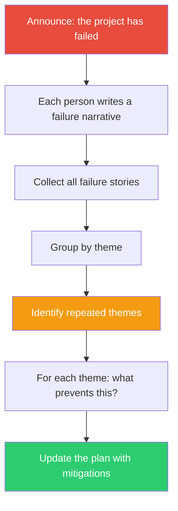

## The Move

Announce: "It's {{timeframe.1}} and this project has failed spectacularly." Now each person (or you, solo) writes the story of why it failed — not a risk list, but a narrative. What specifically went wrong? What was the root cause? What did we ignore? Write it in past tense, as if it already happened. Collect all failure stories, then group them by theme. For each theme, ask: what could we do right now to prevent this specific failure? The failures that multiple people independently wrote about are the ones to take most seriously.

## When to Use

- Before committing to a plan, especially one with broad consensus
- When the team is excited and nobody is voicing concerns
- Before a major resource commitment — hiring, rewrite, product launch
- When you want to surface risks that people are reluctant to raise directly
- As a counterbalance to planning optimism

## Diagram

## Example

**Situation:** A team is about to rewrite their monolithic billing system as microservices. Everyone's excited. The plan is 4 months.

**Pre-mortem narratives:**

- *"We finished the new system in 6 months, not 4. During the migration, we ran both systems in parallel and the data got out of sync. Three customers were double-charged. We spent two months fixing billing discrepancies instead of shipping features."*
- *"The new services worked fine individually, but the end-to-end billing flow had race conditions we never caught in unit tests. We didn't have integration tests because everyone assumed someone else was writing them."*
- *"Two months in, the payments team got pulled onto an urgent compliance project. The rewrite lost momentum. When they came back, half the design decisions needed revisiting because the regulatory requirements had changed."*

**Themes:** Data migration risk, integration testing gap, team availability.

**Mitigations:** (1) Build a reconciliation checker before migration, not after. (2) Write end-to-end billing flow tests in week one. (3) Get explicit commitment that the payments team is protected from re-assignment for the duration, or plan for the interruption.

## Watch Out For

- The power of this move is the past tense. "What could go wrong?" invites hedging. "It failed — why?" invites honesty. Don't skip the framing
- In a group setting, have people write independently before sharing. Otherwise the first person's story anchors everyone else
- Pre-mortems surface risks, but they don't prioritize them. Not every failure story deserves a mitigation — some are unlikely enough to accept. Prioritize by likelihood and severity
- Don't let the pre-mortem kill momentum. The goal is to strengthen the plan, not to argue against doing it. If the pre-mortem makes you cancel the project entirely, the project probably shouldn't have gotten this far
