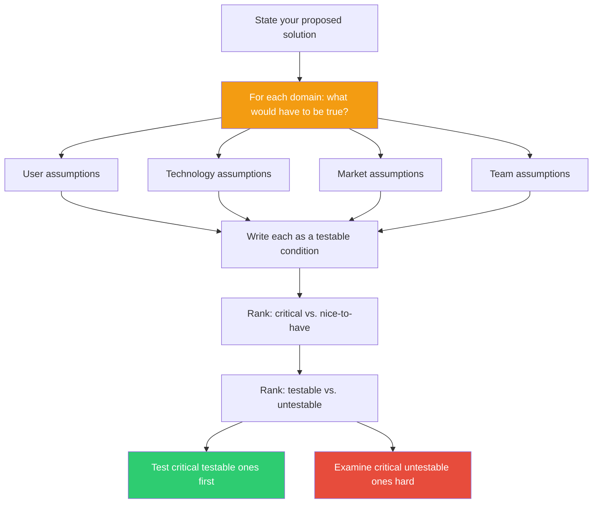

## The Move

Take your proposed solution and complete this sentence for each domain: "For this to work, it would have to be true that ___." Cover at least these domains: the user (behavior, needs, willingness), the technology (feasibility, performance, reliability), the market or environment (timing, competition, regulation), and the team (skills, capacity, coordination). Write each assumption as a specific, testable condition — not "users will like it" but "at least 30% of current users will complete onboarding within 5 minutes." Now rank the assumptions by two axes: how critical they are (if false, does the whole plan collapse?) and how testable they are (can you validate this cheaply?). Test the critical, testable ones first. Stare hard at the critical, untestable ones. After listing your assumptions, ask: would {{persona.1}} agree with these? Which assumptions would they challenge?

## When to Use

- Before committing to a strategy, to surface hidden assumptions
- When a team disagrees about a plan — often they actually disagree about assumptions
- When you feel confident but haven't articulated why
- To turn a strategy debate into a testable experiment
- When comparing multiple options — compare their assumptions, not just their features

## Diagram

## Example

**Proposed solution:** "We'll build a Slack bot that summarizes long threads so people stop missing important decisions."

**What would have to be true:**

- **User:** People actually miss decisions because threads are long (not because they mute channels). At least 40% of teams have threads over 20 messages where decisions get buried.
- **Technology:** An LLM can reliably distinguish "a decision was made" from "people are still debating." False positives (summarizing a non-decision as a decision) would be worse than missing one.
- **Market:** People won't just switch to a tool that already does this (Notion AI, Loom summaries). Our integration advantage in Slack is enough to win.
- **Team:** We can ship a reliable v1 in 6 weeks with our current backend team, without pulling anyone off the core product.

**Ranking:** The user assumption is critical and testable — survey 20 teams this week. The technology assumption is critical and testable — run the summarizer on 100 real threads and check accuracy. The market assumption is critical but harder to test. The team assumption is critical and testable — talk to the engineering lead today.

**Scariest assumption:** The technology one. If the LLM can't distinguish decisions from debate, the product is worse than useless.

## Watch Out For

- The most dangerous assumptions are the ones you don't think to list — they feel so obvious that you skip them. Push yourself to list at least two more than feel natural
- "Testable" doesn't mean "easy." Some assumptions require building something to test. That's fine — but know the cost before you commit
- This move is especially powerful when two people disagree. Often they agree on the solution but disagree on an assumption. Finding the specific assumption unlocks the debate
- Don't treat this as a box-checking exercise. The value is in discovering the assumption that, if false, collapses everything. That one gets your attention first
