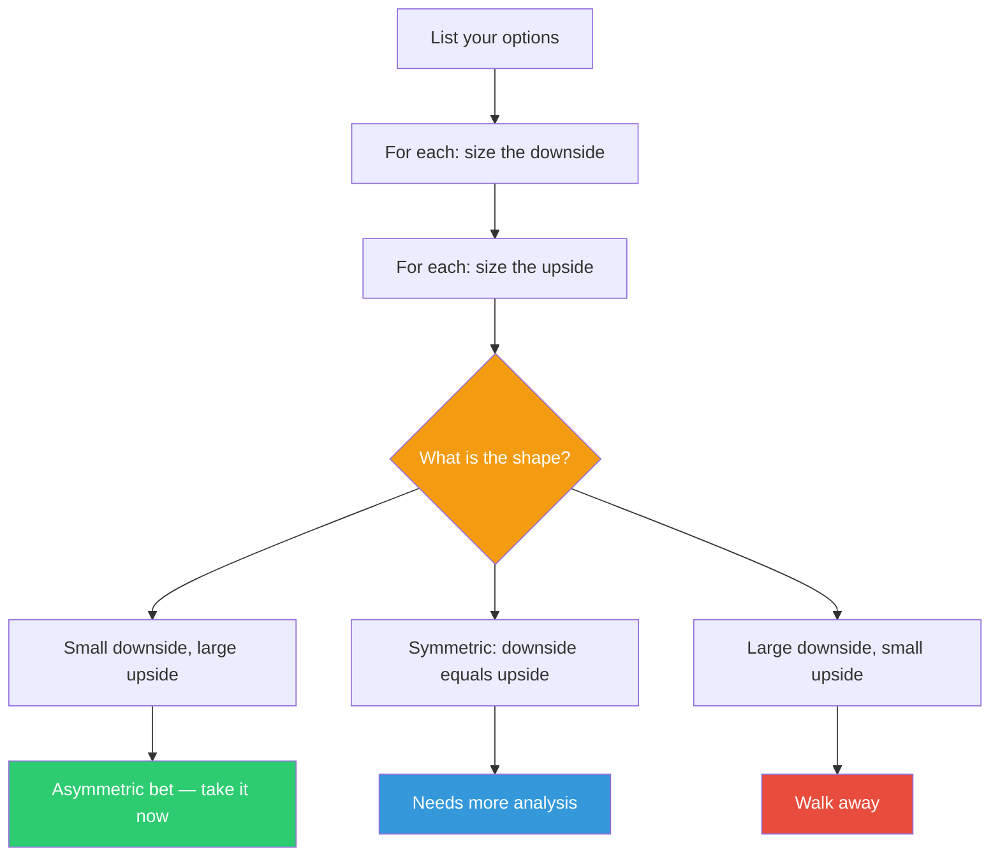

## The Move

For each option on the table, write two numbers: the downside if you're wrong (cost, time lost, reputation damage) and the upside if you're right (revenue, time saved, learning gained). Check the shape: is the downside capped and small while the upside is open-ended and large? If yes, you have an asymmetric bet — take it without waiting for certainty. If the downside and upside are roughly symmetric, you need more analysis. If the downside is large and the upside is small, walk away. If this fails, you lose {{hours}} hours. If it works, what's the upside? The key question is not "will this work?" but "what do I lose if it doesn't?"

## When to Use

- The team is stuck in analysis paralysis, debating a decision that could be tested cheaply
- You're treating a reversible decision as if it were permanent
- Someone proposes an experiment but leadership wants "more data" before greenlighting it
- You need a framework to compare options that have different risk profiles
- The cost of delay (not deciding) is itself a cost nobody is accounting for

## Diagram

## Example

**Decision:** "Should we rewrite our notification service in Rust, or keep patching the Node.js version?"

**Option A: Rewrite in Rust.**
- Downside: 3 engineer-months. If it fails, we still have the Node.js service and we learned a lot about our performance bottlenecks. Team gains Rust experience.
- Upside: 10x throughput improvement, eliminates the class of memory bugs causing weekend pages, the team has wanted to learn Rust.

**Option B: Keep patching Node.js.**
- Downside: Continuous small costs — a few hours per week firefighting, occasional weekend incidents, growing tech debt.
- Upside: No upfront investment. Familiar tech.

**Assessment:** Option A is asymmetric. The downside is capped (3 months, reversible, produces learning). The upside is large (eliminates an entire category of problems). Option B has no upfront cost but an uncapped ongoing downside — death by a thousand cuts.

**Decision:** Take the Rust rewrite. You don't need to prove it will succeed — you just need to confirm the downside is survivable. It is.

## Watch Out For

- People systematically overestimate the downside and underestimate the upside. Actually write the numbers. "It could go badly" is not a sized downside
- The biggest hidden cost is often the cost of *not* deciding. Weeks spent debating is itself a loss. Include it in your calculation
- Not every asymmetric bet is worth taking — you have a limited budget for bets. Prefer the ones where the learning value is high even if the bet fails
- Irreversibility is the key factor. A decision you can undo in a week is almost always worth trying. A decision you can't undo deserves real analysis. Most decisions are more reversible than they feel
- "Small downside" must be actually small, not "small if everything goes as planned." Size the downside assuming things go somewhat wrong
