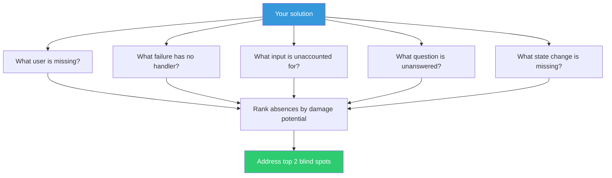

## The Move

Look at your solution, design, or plan. Instead of evaluating what's there, list what's absent. Answer these five questions: (1) What user did you not consider? (2) What failure mode has no handler? (3) What input did you not account for? (4) What question does this design not answer? (5) What transition or state change is missing?

What would {{persona.1}} notice is conspicuously absent? Write each absence down. Rank them by how damaging they'd be if they surfaced in production. The top two absences are your blind spots — address them before calling the design done.

## When to Use

- You've finished a design and it feels suspiciously clean
- A review passed with no objections and that makes you nervous
- You're evaluating someone else's proposal and want to find what they missed
- You need to stress-test a plan without building a full prototype

## Diagram

## Example

**Solution under review:** An API design for a collaborative document editor. It has endpoints for create, read, update, delete, share, and real-time sync.

**What's not there:**
1. **Missing user:** What about the user who was shared-to but doesn't have an account yet? No invited-user flow exists.
2. **Missing failure mode:** What happens when two users edit the same paragraph simultaneously and the sync fails? No conflict resolution endpoint or strategy.
3. **Missing input:** What about documents with embedded images or files? The schema only handles text.
4. **Missing question:** Who can revoke sharing permissions? The share endpoint exists but there's no unshare.
5. **Missing transition:** What happens when a document owner deletes their account? No ownership-transfer or orphan-document handling.

**Result:** Items 2 and 4 ranked highest for damage potential. Conflict resolution was added to the design before implementation. The unshare endpoint was trivial to add but would have been embarrassing to discover in production.

## Watch Out For

- This move finds gaps, not solutions. Once you've identified the absence, you still need to decide whether it matters enough to address now
- Don't use this to generate an infinite punch list. Five questions, top two absences — then move on
- Absence-hunting can become perfectionism. Some gaps are acceptable. The question is "would this absence cause real harm?" not "is this theoretically incomplete?"
- If you can't find any absences, ask someone unfamiliar with the project to look. Fresh eyes see negative space more easily
