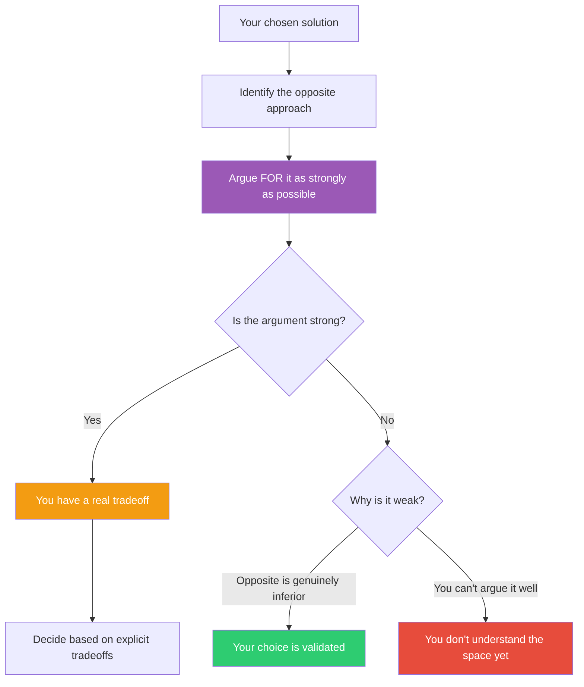

## The Move

Take your current solution and identify its opposite — the approach you rejected, the architecture you dismissed, the design philosophy you think is wrong. Now argue **for** it as strongly and charitably as you can. Spend at least 15 minutes building the best possible case: what problems does it solve elegantly? What assumptions does your preferred approach make that the opposite doesn't? Under what conditions would the opposite actually be superior? Argue for the opposite as if you were {{persona.1}} making their strongest case. If the resulting argument is weak, pressure-test why — either the opposite truly is inferior (and now you can articulate exactly why), or you don't understand the problem space well enough to evaluate either option.

## When to Use

- You've chosen an approach and want to validate it against the strongest version of the alternative
- A teammate proposed something you instinctively rejected and you want to check your reasoning
- You're in a design review and the discussion feels one-sided
- You suspect your preference is driven by familiarity rather than analysis

## Diagram

## Example

**Situation:** You're building a new internal tool and you've chosen a single-page app (SPA) with React. A colleague suggested server-rendered HTML with HTMX. You dismissed it as "too limited."

**Steel man the opposite:** Server-rendered HTML with HTMX would eliminate the entire build pipeline. No webpack, no bundling, no client-side state management. The team already knows the backend language. HTMX handles 80% of the interactivity this tool needs — partial page updates, form submissions, lazy loading. The remaining 20% could be handled with small islands of vanilla JS. Deployment is simpler. Time-to-first-meaningful-paint is faster. The total lines of code would be roughly half. And for an internal tool with 50 users, the SPA's advantages (offline support, complex client-side state, smooth transitions) are solutions to problems that don't exist here.

**Result:** The steel man is uncomfortably strong. The SPA choice was driven by team familiarity with React, not by the problem's requirements. You switch to HTMX for this project — or at minimum, you now have a real conversation about tradeoffs instead of reflexive dismissal.

## Watch Out For

- You must genuinely try to make the opposite case win. If you're building a straw man and then knocking it down, you're just confirming your bias with extra steps
- This move takes real effort and intellectual honesty. Budget 15-30 minutes. Rushed steel manning is just devil's advocacy theater
- The goal isn't necessarily to switch — it's to understand the tradeoff space. Sometimes you steel man the opposite and still choose your original approach, but now you know exactly what you're trading away
- If you find yourself unable to generate any arguments for the opposite, bring in someone who holds that view. Your blind spot might be bigger than you think
