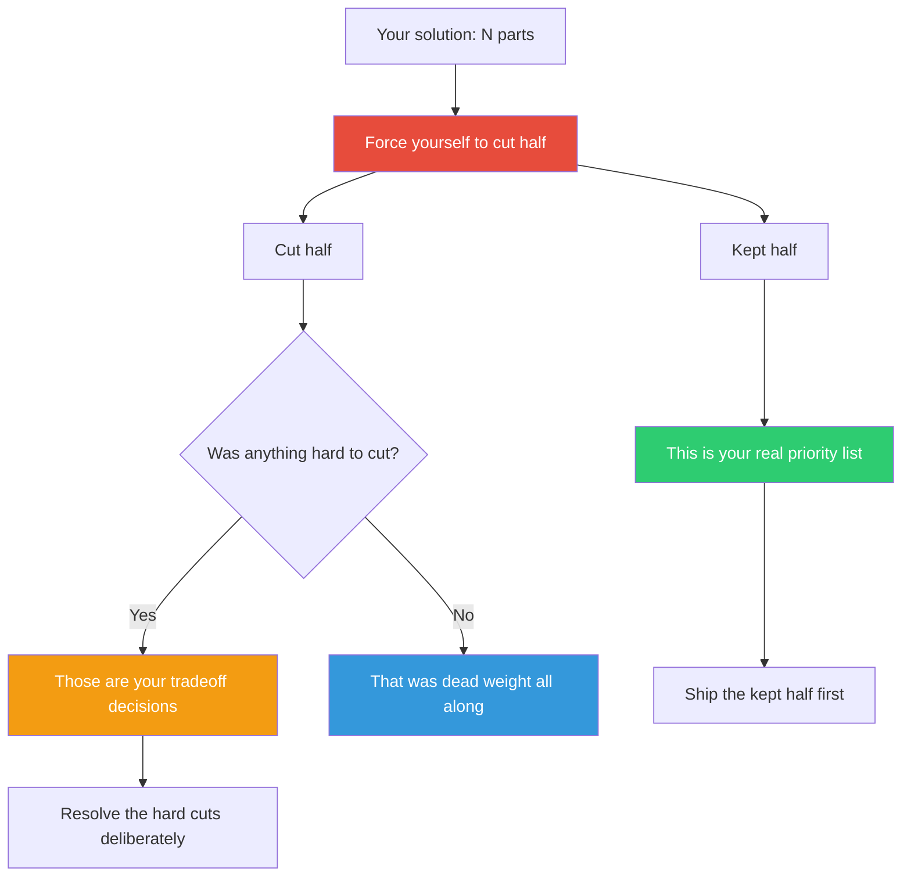

## The Move

Count the components, features, steps, or pieces in your solution. Now remove exactly half. Not "trim a little" — cut the count in half. You must choose which half survives. Write down the kept half and the cut half in two columns. The kept column is your actual priority ranking made visible. If you agonize over a particular cut, that tension is information: it means you've found two things competing for the same importance tier. If cutting something feels easy, it was already dead weight.

## When to Use

- The solution has grown large and you've lost sight of what's essential
- You need to scope down but every part feels equally important
- You're preparing for a deadline and need to find the minimum viable version
- A design review left you with a long list of "must-haves" that can't all be must-haves

## Diagram

## Example

**Situation:** You're building a project management tool. The v1 feature list has 12 items: task creation, task assignment, due dates, recurring tasks, subtasks, file attachments, comments, @mentions, labels/tags, kanban board view, calendar view, and time tracking.

**Delete half — keep 6:** Task creation, task assignment, due dates, comments, labels/tags, kanban board view.

**The cut half:** Recurring tasks, subtasks, file attachments, @mentions, calendar view, time tracking.

**What you learn:** The kept half is a functional project board. The cut half is mostly power-user features and alternative views. The hardest cut was subtasks — it nearly made the keep list. That tells you subtasks should be the first thing you add in v1.1, not something you delay indefinitely. Time tracking and calendar view were easy cuts, which means they were feature-list padding, not core value.

**Result:** v1 ships in 6 weeks instead of 14. Users get a usable tool fast. You add subtasks in week 8 based on actual demand, and quietly drop calendar view when nobody asks for it.

## Watch Out For

- Half is not negotiable during the exercise. "I cut 40%, that's close enough" defeats the mechanism. The forcing function is the point
- Don't cut by removing all the hard things and keeping all the easy things. Cut by importance, not implementation difficulty
- This pairs with TF-018 (Kill Your Darlings) — if something you're emotionally attached to ends up in the cut half, pay attention
- You may discover that after cutting half, the remaining half is actually a better product, not just a smaller one. Simplicity has its own value
