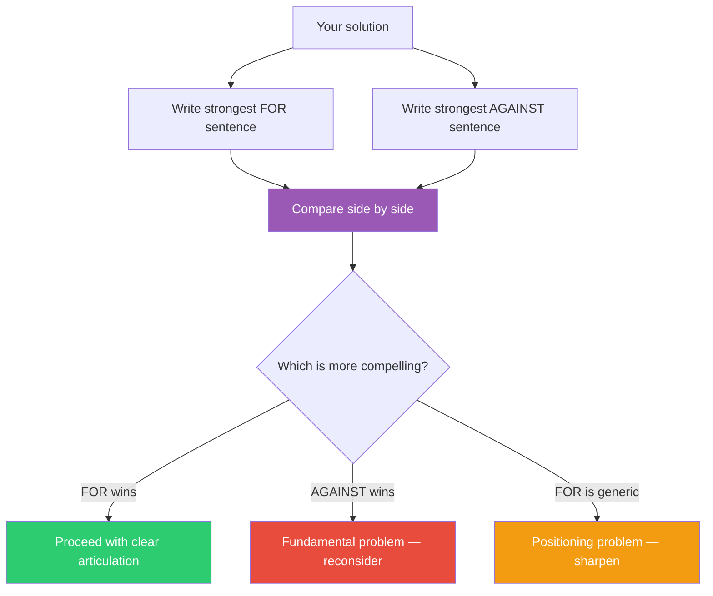

## The Move

Write ONE sentence that is the strongest possible argument FOR your solution. Write ONE sentence that is the strongest possible argument AGAINST it. Both must be specific — no generic praise ("it's simpler and faster") or generic criticism ("it might not scale").

Now compare them side by side. If the "against" sentence is more compelling, you have a fundamental problem. If the "for" sentence is boring or generic, you have a positioning problem — your solution may be good but you can't articulate why. If both sentences are strong and specific, you understand your decision and you're ready to make it.

## When to Use

- You need to quickly pressure-test a solution without a full evaluation session
- You're about to present or pitch an idea and want to sharpen your reasoning
- You suspect you're rationalizing rather than reasoning
- A decision is being made and you want to force clarity in under two minutes
- You have a gut feeling about an approach but can't defend it crisply

## Diagram

## Example

**Solution:** Rewrite the monolithic API as microservices.

**FOR:** "Three teams are currently blocked by each other on every release because the monolith forces them to deploy in lockstep — microservices let each team ship independently on their own schedule."

**AGAINST:** "We have four engineers, none with distributed systems experience, and microservices will turn every simple database query into a network call with failure modes nobody on the team knows how to debug."

**Comparison:** The "for" sentence identifies a real, specific pain (deploy coupling across three teams). The "against" sentence identifies a real, specific risk (team size and skill mismatch). Both are strong. This is a genuine tradeoff, not an obvious call.

**What this reveals:** The decision hinges on team size and growth trajectory, not on architecture philosophy. If the team is growing to 20 in a year, the "for" argument strengthens. If it's staying at four, the "against" argument is decisive. The two sentences turned an abstract architecture debate into a concrete staffing question.

## Watch Out For

- The constraint is one sentence each. If you need a paragraph, you haven't found the sharpest version of the argument yet. Compression forces clarity
- Generic "for" sentences are a red flag even if you believe the solution is correct. "It's more maintainable" or "it's the industry standard" means you haven't identified the specific value. Why is it more maintainable? For whom? Under what conditions?
- Don't write the "against" sentence to be easy to defeat. Write it as if someone brilliant and well-informed is arguing against you. If you can't generate a strong "against" sentence, show the solution to a skeptic and use their objection
- This move is a snapshot, not a verdict. It tells you the shape of the decision in two minutes. For high-stakes decisions, follow up with a deeper evaluation
