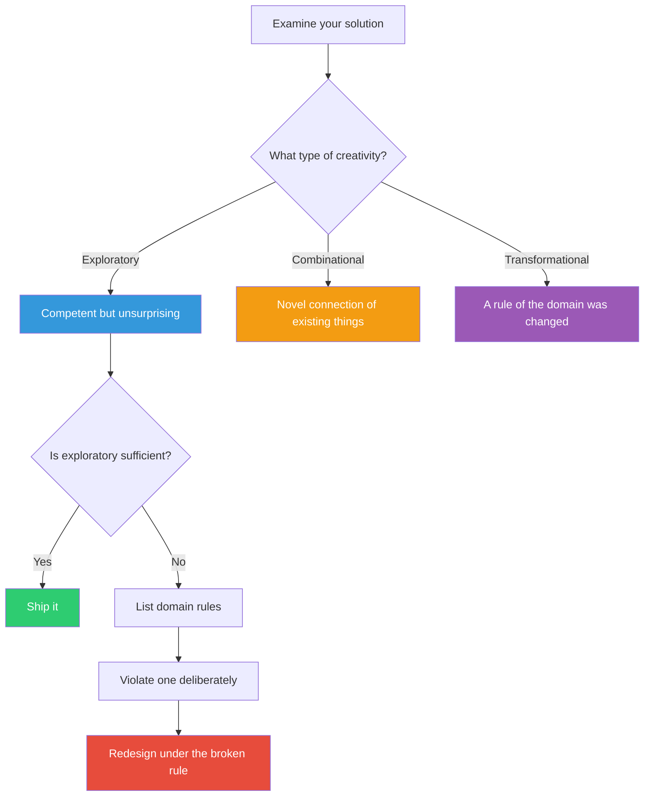

## The Move

Classify your current solution into one of three categories:

**(A) EXPLORATORY** — A competent answer that works within the established rules of the domain. It is the kind of solution a skilled practitioner would produce. Nothing is wrong with it, but nothing is surprising either.

**(B) COMBINATIONAL** — It connects two existing things in a way that has not been connected before. The pieces are familiar; the combination is not. Ask: what two previously separate things am I joining?

**(C) TRANSFORMATIONAL** — It changes a rule of the domain itself. Something that was assumed to be fixed is now variable. Something that was impossible is now permitted. Ask: what rule did I violate?

Most solutions are (A). If the task calls for genuine originality, you need at least (B) and possibly (C). To reach (C): list the rules and assumptions of the domain — optionally borrow rules from **{{domain.1}}** to see your domain's constraints from outside — then deliberately violate one.

## When to Use

- After generating a solution, to evaluate its novelty level
- When a brief calls for "innovative" or "disruptive" and you want to verify you are delivering that
- When a team is satisfied with a solution and you want to pressure-test whether satisfaction is warranted
- When comparing multiple solutions and "originality" is one of the evaluation criteria

## Diagram

## Example

**Problem:** "Design a better checkout flow for our e-commerce platform."

**Solution:** A streamlined 3-step checkout with auto-fill, progress bar, and guest checkout option.

**Classification:** This is **(A) Exploratory**. It is a well-executed version of the standard checkout pattern. Every element follows the established rules of e-commerce UX. Nothing is wrong with it.

**If you need (B) Combinational:** What if checkout borrowed from messaging apps? A conversational checkout where the user "chats" their way through the purchase, with the system inferring details from natural input instead of presenting form fields.

**If you need (C) Transformational:** The rule being violated is "checkout is a process the user goes through." What if there is no checkout? The user adds items, and the system charges them at end-of-day for everything in their cart unless they remove it (like a tab at a bar). This transforms the fundamental rule that purchasing requires an explicit confirmation step.

The transformational version might be impractical. That is fine — the exercise of identifying the rule and breaking it often reveals intermediate ideas (like a "running tab" mode for repeat customers) that are both novel and shippable.

## Watch Out For

- Transformational is not automatically better. Many contexts call for exploratory excellence. A surgeon should not transform the rules of surgery during your operation
- "Combinational" requires that the combination actually produces emergent properties — not just two features jammed together. "Checkout plus chatbot" is not combinational unless the combination changes the user's experience in a way neither component achieves alone
- The domain rules you need to list are not technical constraints — they are conceptual assumptions. "Users see a price before buying" is a domain rule. "We use PostgreSQL" is an implementation detail
- This move is for evaluation, not generation. Classify first, then decide if you need to push further
