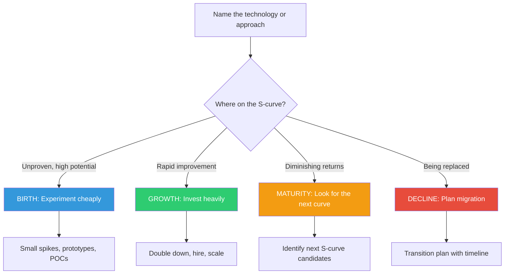

## The Move

Name the technology, approach, or pattern you're investing in. Place it on the S-curve by answering four questions: (1) Is it still unproven with few adopters but high potential? That's BIRTH. (2) Is it rapidly improving and gaining adoption? That's GROWTH. (3) Have improvements slowed to incremental gains despite heavy effort? That's MATURITY. (4) Is something newer replacing it? That's DECLINE. Once you've located your position, apply the rule: at birth, experiment cheaply. At growth, invest heavily. At maturity, stop optimizing and start looking for the next curve. At decline, migrate.

## When to Use

- When you're debating "optimize vs. rewrite"
- When incremental improvements feel increasingly expensive for diminishing returns
- When a new technology is tempting but your current stack "works fine"
- When making a strategic bet on which approach to invest engineering time in

## Diagram

## Example

**Problem:** "Should we keep optimizing our REST API or move to GraphQL?"

**S-Curve assessment of our REST API:**
- Built three years ago. Stable, well-documented, handles current load.
- Recent "improvements" have been marginal: shaving 20ms here, adding one more cache layer there.
- Each optimization is harder than the last. The team spent two weeks to save 50ms on one endpoint.
- Meanwhile, the frontend team keeps asking for new endpoints to avoid over-fetching.

**Diagnosis: MATURITY.** The REST API has plateaued. More optimization effort yields less improvement. The fundamental architecture (fixed endpoints, over/under-fetching) creates friction that no amount of tuning will resolve.

**S-Curve assessment of GraphQL:**
- Widely adopted, strong tooling ecosystem, proven at scale by major companies.
- For our use case (varied frontend data needs), it addresses the structural problem REST can't.

**Diagnosis: GROWTH phase for our adoption** (the technology itself is mature, but our use of it would be new).

**Decision:** Don't pour more engineering into REST endpoint optimization. Instead, build a GraphQL layer that wraps existing REST services as a migration path. Invest in the growth curve, not the mature one.

## Watch Out For

- Don't confuse "I'm bored of this technology" with "this technology is in decline." Your personal interest curve is not the S-curve
- A technology can be at different S-curve positions for different use cases. SQL is mature for OLTP but was reborn for analytics with columnar stores
- The "next curve" is not always better. New S-curves start at birth, which means risk. Jumping curves has a cost — factor it in
- Teams sometimes call something "mature" to justify a rewrite they want to do for resume-driven reasons. Check the evidence honestly
