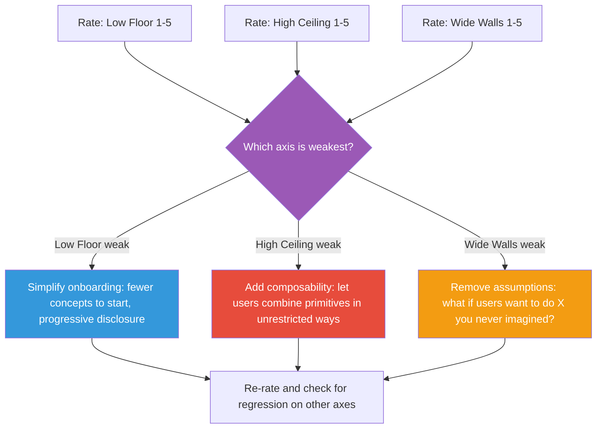

## The Move

Draw three scales from 1 to 5. Rate your design on each: (1) LOW FLOOR — can someone with no prior knowledge start doing something meaningful in under 5 minutes? No install, no config, no tutorial required? (2) HIGH CEILING — can an expert accomplish sophisticated, complex tasks? Does the tool grow with the user or does it cap out? (3) WIDE WALLS — can people use this for purposes you didn't intend? Does the design support diverse goals, or does it funnel everyone through one workflow? Identify your weakest axis. Most designs score well on one or two but fail on the third. A low floor without high ceiling is a toy. A high ceiling without low floor is expert-only tooling. Narrow walls mean the designer is too controlling.

## When to Use

- You're evaluating an API, a developer tool, a framework, or a platform
- User research shows different segments having wildly different experiences
- You're deciding between "simple but limited" and "powerful but complex" and need a framework for the tradeoff
- A product feels "done" but something about it bothers you and you can't name it

## Diagram

## Example

**Situation:** A team has built an internal data pipeline framework. Engineers write YAML config files to define ETL jobs. It's been in use for a year and adoption has stalled.

**Rating:**
- **Low Floor: 2/5.** A new engineer needs to understand 14 YAML fields, the job scheduling model, and the schema registry before writing their first pipeline. Average time to first working pipeline: 3 days.
- **High Ceiling: 4/5.** Power users can build complex multi-stage pipelines with branching, backfill logic, and custom transforms. The framework handles their most sophisticated needs.
- **Wide Walls: 1/5.** Every pipeline follows the same extract-transform-load pattern. A team that wanted to use it for reverse ETL (loading data back into SaaS tools) had to fight the framework. Another team wanted event-driven pipelines instead of batch — impossible without forking.

**Weakest axis: Wide Walls.** The framework assumes batch ETL. The fix: decouple the scheduling engine from the ETL semantics. Let users define arbitrary "steps" that the framework orchestrates, rather than requiring extract/transform/load stages. This also improved the floor (fewer mandatory fields) as a side effect.

## Watch Out For

- Raising one axis often lowers another. Adding power features (ceiling) can clutter the onboarding (floor). Track all three when you change one
- "Wide walls" is the most counterintuitive axis. It requires accepting that users will do things you didn't plan for — and designing to support that rather than prevent it
- A score of 5 on all three axes is nearly impossible and probably not worth pursuing. Aim for 4/4/3 or better, and know which axis you're deliberately accepting a lower score on
- Don't confuse "wide walls" with "no opinions." A tool can have strong defaults and conventions while still supporting diverse use cases. Rails has wide walls despite being highly opinionated
