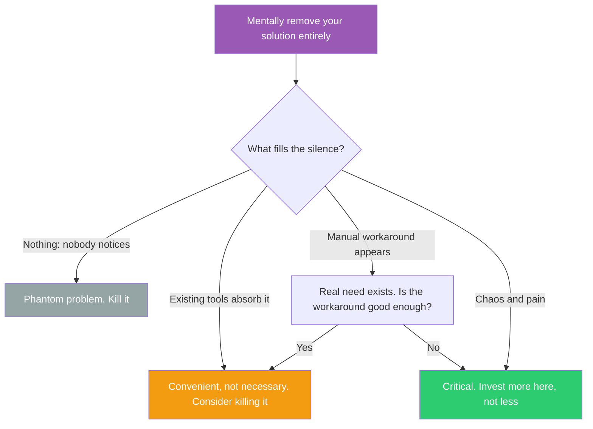

## The Move

Mentally remove your solution — the feature, the service, the tool, the process — entirely. Not "what if it broke" but "what if it never existed." Delete your solution mentally. At {{timeframe.1}}, what filled the gap? Now observe the silence: If users would route around it immediately using existing tools, your solution is convenient but not necessary. If nothing fills the gap and nobody notices, you're solving a phantom problem. If something unexpected fills the gap — a workaround, a manual process, a competitor — THAT reveals the real dynamic you should be designing for. Cage's 4'33" revealed that silence isn't silent — the ambient sounds of the room ARE the music. Your system's absence isn't empty either. What's in the negative space?

## When to Use

- You're evaluating whether a feature is worth maintaining or building
- A service has been running for months and you don't know if it matters
- You need to make a kill/keep decision on a project or component
- You suspect you're solving a problem that doesn't exist or has already been solved elsewhere

## Diagram

## Example

**Situation:** A platform team maintains a "service registry" — an internal tool where every microservice is documented with its owner, dependencies, SLAs, and runbooks. It took 6 months to build and requires every team to keep their entries up to date. Compliance is about 60%. The platform team is debating whether to invest in v2 with better UI and automated discovery, or kill it.

**The silence test:** Imagine the service registry never existed. What fills the gap?

- **For incident response:** Engineers already check Datadog dashboards and Slack channels during incidents, not the registry. The registry's runbook links are 8 months stale. Silence fills with: existing Datadog + Slack. No pain.
- **For onboarding:** New engineers use the registry to understand the architecture. Without it, they'd ask their team lead or read the architecture doc in Notion. Silence fills with: existing Notion docs + humans. Mild inconvenience but survivable.
- **For dependency tracking:** This is where the silence gets loud. When Service A goes down, nobody knows which other services depend on it without the registry. Without it, teams discover dependencies during outages. The silence fills with: painful surprises at 3 AM.

**Result:** The registry is solving one real problem (dependency tracking) and two phantom problems (incident runbooks, onboarding). v2 should be a lightweight dependency graph with automated discovery, not a bigger version of the existing documentation tool. The team cut 70% of the planned v2 scope.

## Watch Out For

- The silence test works best for existing systems, not new ideas. If you haven't built it yet, you can't easily imagine its absence — use a different evaluation method
- "Nobody would notice" is sometimes wrong because the value is indirect. A security audit tool provides no visible value until the day it catches something. Test for absence over a meaningful timeframe
- Don't confuse "users would work around it" with "users don't need it." Working around something is a cost — the question is whether that cost is lower than the cost of your solution
- This test has a bias toward visible, frequent value. It undervalues things that matter rarely but enormously (disaster recovery, compliance, security). Apply it to features, not safeguards
