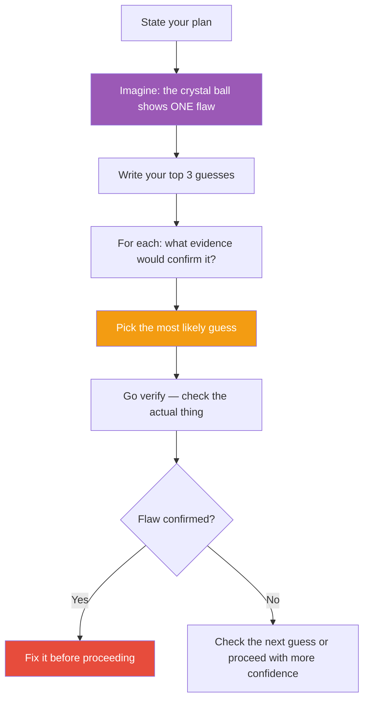

## The Move

You have a crystal ball. It can show you one thing: a flaw in your plan that you haven't seen yet. Not a risk that might happen — a flaw that exists right now. Write down your top 3 guesses for what the crystal ball would reveal. These are the areas where your confidence exceeds your evidence. For each guess, write what evidence you would need to confirm or rule it out. Now go check the most likely one — actually look at the code, the data, the contract, the user behavior. Don't theorize. Verify.

## When to Use

- You feel confident about a plan but haven't stress-tested that confidence
- A decision is about to become irreversible and you want one last check
- Everyone agrees and no one is playing devil's advocate
- You've done risk analysis but suspect it only covers the risks you already knew about
- You're about to ship and have a nagging feeling you can't name

## Diagram

## Example

**Situation:** You're about to launch a new pricing tier. The plan looks solid — new Stripe products configured, feature flags in place, marketing copy reviewed.

**Crystal ball guesses:**

1. *"Existing customers on the old plan can access the new-tier features through the API even though the UI gates them — we never checked the API authorization layer."*
2. *"The upgrade flow works, but the downgrade flow hasn't been tested. If someone upgrades by mistake, there's no way back without support intervention."*
3. *"We calculated the price based on our costs but never validated that customers would actually pay it. The number is made up."*

**Most likely:** Guess #2 — the downgrade flow.

**Verification:** Walk through the downgrade path in staging. Result: the downgrade button exists but it doesn't prorate the refund, and it silently deletes data associated with the higher tier. The flaw was real and would have generated support tickets on day one.

## Watch Out For

- This is not the same as a pre-mortem. A pre-mortem imagines future failure. The crystal ball asks what's already wrong right now — a flaw in the current plan, not a risk that might materialize
- Your guesses reveal your blind-spot topology. If all three guesses are technical, you might be ignoring business or user-experience flaws. Spread your guesses across different domains
- The value is in the verification step. Writing guesses without checking them is just worry. The move only works if you actually go look
- If you can't think of three guesses, your mental model of the plan is probably too abstract. Zoom into the specifics until the cracks appear
