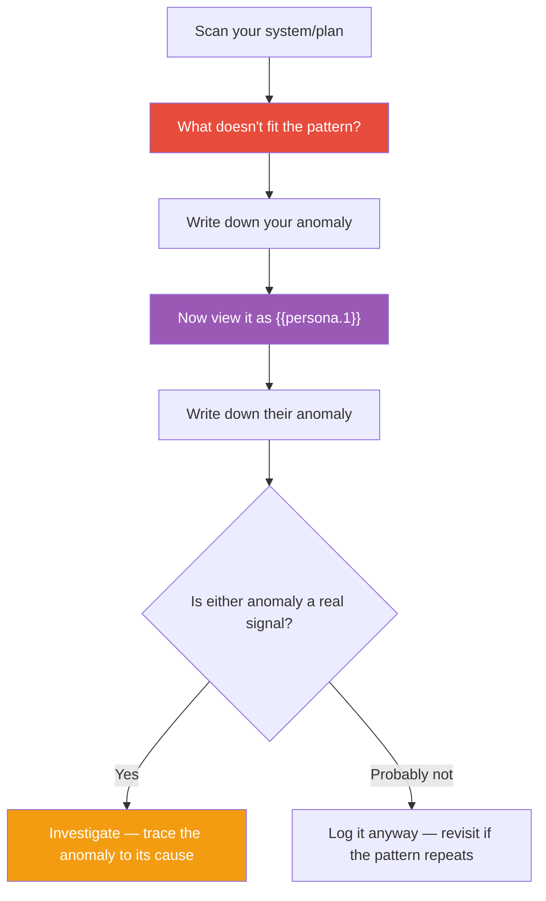

## The Move

Look at your system, solution, or plan. Don't review it systematically — instead, scan it the way an expert scans a scene: what DOESN'T fit? What's the one element that breaks the pattern? It might be a component that's more complex than its neighbors, a metric that's stable when everything else is volatile, a dependency that points the wrong direction, or an assumption that contradicts another assumption. Write it down. Now imagine **{{persona.1}}** looking at the same thing — what anomaly would they notice that you've been overlooking because you're too close? Write that down too. Anomalies are often early warnings. Investigate before dismissing.

## When to Use

- You have a nagging feeling about a design or plan but can't articulate it
- A system is working but something seems subtly wrong
- You want to catch problems before they become failures
- You've been staring at something so long you can't see it fresh
- Post-incident, to train yourself to notice warning signs earlier

## Diagram

## Example

**Situation:** You're reviewing the architecture for a new notification service. It has a message queue, a delivery worker, a template engine, and a preferences store. Everything looks clean and well-decomposed.

**Your anomaly:** The preferences store is a separate service with its own database, but it's only ever called by the delivery worker. Every other service in the architecture communicates with multiple consumers. This one has exactly one. Why is it isolated?

**{{persona.1}} anomaly:** Say the persona is "a firefighter." A firefighter would ask: "Where's the kill switch?" There's no way to stop all notifications in an emergency. If the template engine renders something wrong, there's no circuit breaker — the system will blast malformed messages to every user before anyone can intervene.

**Investigation:** The preferences store was split out because someone planned to use it from the mobile app too, but that plan was abandoned. It should be a module inside the delivery worker, not a separate service. And the missing kill switch is a genuine gap — the anomaly surfaced a real architectural flaw.

## Watch Out For

- Anomalies are not always problems. Sometimes the odd element is intentionally different for good reasons. The goal is to notice and investigate, not to assume everything unusual is wrong
- If you can't find any anomaly, you're either looking at something genuinely clean or you've lost the ability to see it fresh. Try explaining it to someone new and watch where they pause
- The persona shift is critical. Different expertise sees different anomalies. A security expert, a performance engineer, and a product designer would each spot something different. The persona forces you out of your own lens
- Don't confuse complexity with anomaly. A complex component isn't anomalous in a complex system. Look for things that break the LOCAL pattern, not things that are globally unusual
