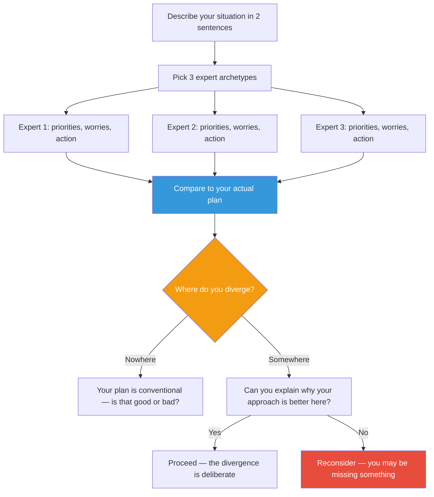

## The Move

Describe your situation in two sentences. Your expert panel includes {{thinker.1}} and {{thinker.2}}. Now convene an imaginary expert panel — three people with relevant expertise (name specific archetypes: "a database reliability engineer," "a product manager who's launched 20 features," "the original architect of this system"). For each expert, write down: (1) what they would prioritize in this situation, (2) what they would worry about, and (3) what action they would take. Compare these to your actual plan. Where do you agree with the panel? Where do you diverge? Divergence is not automatically wrong — but it should be deliberate. For each divergence, write one sentence explaining why your approach is better than the expert's for this specific context.

## When to Use

- You're making a decision that would normally get a senior review, but you're on your own
- You want to gut-check your approach against what experienced practitioners would do
- You're a generalist making a specialist decision (or vice versa)
- The decision feels important but you can't articulate why your approach is the right one
- You want to train your own judgment by comparing it to expert archetypes

## Diagram

## Example

**Situation:** You need to add full-text search to an existing Rails app. Current plan: add Elasticsearch alongside PostgreSQL.

**Expert panel:**

- **Senior Rails developer** — Priority: keep the stack simple. Worry: Elasticsearch adds operational complexity for a feature that might not need it. Action: use PostgreSQL's built-in full-text search first, migrate to Elasticsearch only if it can't handle the load.
- **Search infrastructure engineer** — Priority: relevance quality and query performance. Worry: PostgreSQL full-text search has limited ranking and no fuzzy matching. Action: Elasticsearch from the start, but with a clear abstraction layer so the search backend is swappable.
- **SRE / ops lead** — Priority: reliability and operational burden. Worry: who maintains the Elasticsearch cluster? Action: use a managed service (Elastic Cloud, OpenSearch on AWS), never self-host.

**Your plan divergence:** You planned to self-host Elasticsearch on a single node. All three experts disagree with some aspect of this. The Rails expert says you don't need ES yet. The search engineer says fine, but abstract it. The SRE says never self-host. The convergent advice: start with PostgreSQL full-text search behind an abstraction layer; migrate to managed Elasticsearch when you hit its limits.

## Watch Out For

- Pick experts who would disagree with EACH OTHER, not just with you. If all three say the same thing, you've created an echo chamber, not a panel
- The goal isn't to always follow the expert consensus. Sometimes you have context they don't — a deadline, a constraint, a strategic bet. But you should be able to articulate why
- If you can't think of what an expert would say, you may not understand the domain well enough to make this decision alone. That's a signal to go find a real expert, not an imaginary one
- Don't confuse "what a cautious person would do" with "what an expert would do." Experts often take decisive action that looks risky to non-experts because they understand the terrain
