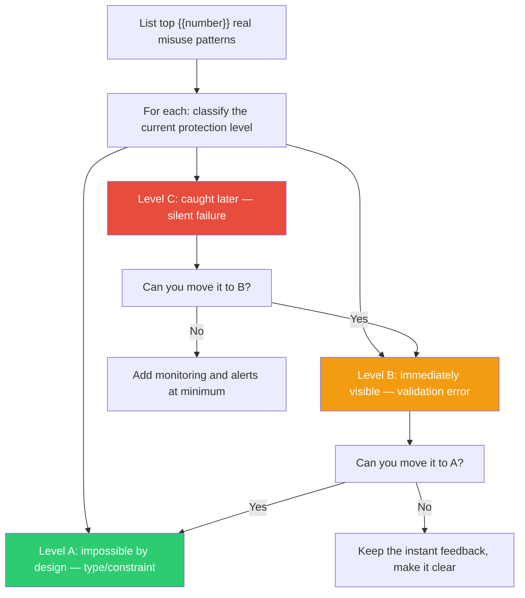

## The Move

List the top {{number}} ways a user, developer, or operator could misuse your system — the mistakes that actually happen, not theoretical ones. For each mistake, classify it: can you make this error (a) impossible by design, (b) immediately visible when it occurs, or (c) only caught later? Then redesign to push each error up the hierarchy. Make impossible what you can — types that reject invalid states, APIs that won't accept bad inputs, UIs that disable illegal actions. For what you can't prevent, make it instantly visible — validation errors at the point of entry, not silent failures discovered hours later. Prevention beats detection beats correction, every time.

## When to Use

- Users or developers keep making the same mistake and documentation isn't helping
- You're designing an API, form, configuration format, or workflow that others will use
- Post-incident, when the root cause was a human error the system should have prevented
- You're about to add a warning or a "are you sure?" dialog — and should ask if you can eliminate the need
- During code review, when you spot a new way the code could be misused

## Diagram

## Example

**Situation:** A deployment pipeline where engineers specify target environments in a YAML config file.

**Top misuse patterns:**

1. **Deploying to production instead of staging** — engineer types `env: production` when they meant `env: staging`. Currently Level C: you find out when production breaks.
   - *Error-proof:* Remove the string field. Replace with a pipeline that infers the environment from the git branch. `main` deploys to production; everything else goes to staging. The engineer can't type the wrong environment because they don't type the environment at all. **Moved to A: impossible.**

2. **Deploying an old commit** — engineer forgets to update the commit SHA. Currently Level C: deploy succeeds with stale code.
   - *Error-proof:* Pipeline always deploys HEAD of the branch. No SHA field exists. **Moved to A: impossible.**

3. **Deploying without running tests** — engineer pushes with `[skip ci]` to save time. Currently Level C: tests never ran.
   - *Error-proof:* Can't fully prevent (sometimes you need emergency deploys). But require an explicit `--emergency` flag that pages the on-call and creates an incident ticket. **Moved to B: immediately visible and socially costly.**

**Result:** Two of three error modes eliminated entirely. The third made visible and accountable. No warnings, no documentation, no "please remember to" — just a system that doesn't allow the bad states.

## Watch Out For

- Don't error-proof things that aren't actual problems. If no one has ever made the mistake, the prevention adds complexity for no benefit. Focus on mistakes that actually happen
- Over-constraining a system can make it unusable. The goal is to make WRONG things hard, not to make RIGHT things hard. If your error-proofing creates friction on the happy path, you've gone too far
- "Are you sure?" dialogs are not error-proofing — they're error-nagging. Users click through them reflexively. If you need a confirmation dialog, the design has already failed
- Some errors can't be made impossible, only detectable. That's fine. The hierarchy is a spectrum, not a binary. Moving from "caught later" to "caught immediately" is still a significant improvement
