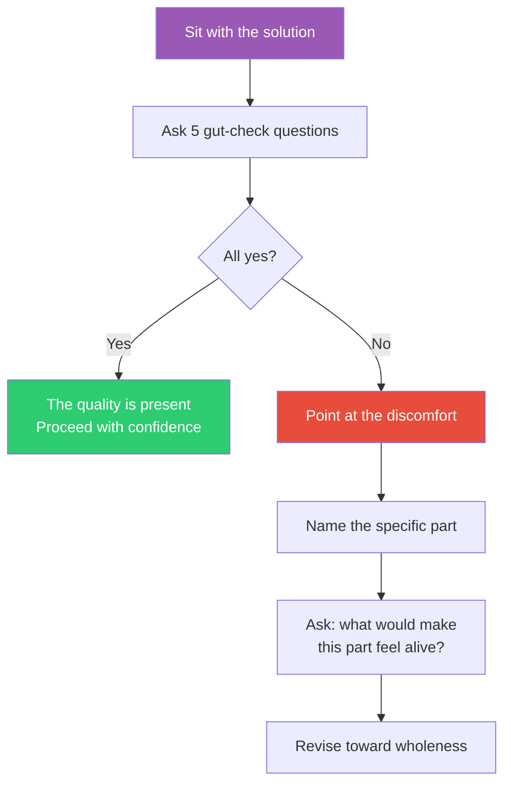

## The Move

Look at your solution — the code, the architecture, the design, the plan. Sit with it. Ask these five questions, answering each with a gut-level yes or no before rationalizing: (1) Does it feel like it WANTS to exist in this form, or am I forcing it? (2) Could I sit with this for a long time without wanting to change anything? (3) Is it free of cleverness — does every part earn its place? (4) Would I be comfortable if someone I respect read this with no context? (5) Does it feel like it belongs, or like it was imposed? If you answered "no" to any question, don't dismiss the feeling. Point at the specific part that triggered the discomfort. That's where the structural problem lives.

## When to Use

- You've finished a design and it "works" but something feels off
- Code passes review but you have a lingering unease
- You want a qualitative check that complements your quantitative tests
- The team is divided on a design and the arguments are rational but inconclusive
- You suspect cleverness or ego is distorting the architecture

## Diagram

## Example

**Situation:** You've built an authentication module. It supports OAuth, SAML, magic links, and password-based login. It's well-tested, well-documented, and handles every edge case. But every time you open the file, you feel a slight dread.

**Applying the questions:**
1. Does it want to exist in this form? *No.* It feels like four separate systems bolted together.
2. Could I sit with it without changing anything? *No.* I keep wanting to extract the common flow.
3. Is it free of cleverness? *No.* There's an abstraction layer that exists to unify four things that aren't actually similar.
4. Would I be comfortable if someone read this cold? *No.* They'd need a diagram to follow the control flow.
5. Does it feel like it belongs? *No.* It feels like it was imposed by a requirements list, not grown from the domain.

**The insight:** The abstraction layer is the problem. It's trying to make four genuinely different auth flows look like one flow, and the result is a forced unity. The quality returns when you let the four flows be four flows with a thin shared interface — less elegant on paper, more alive in practice.

## Watch Out For

- This is a subjective check and it requires honesty. If you're attached to the cleverness, you'll rationalize the "no" answers away. Do the gut check BEFORE the rational justification
- "Quality Without a Name" is not a license to endlessly polish. Use it as a diagnostic, not a perfectionism engine. If the nagging feeling survives two revision attempts, ship it and revisit later
- The quality is easier to feel in small systems. For large systems, apply the check to individual subsystems or interfaces rather than the whole
- Alexander's quality is destroyed by ego. If you're proud of how clever something is, that's a signal to investigate, not celebrate
