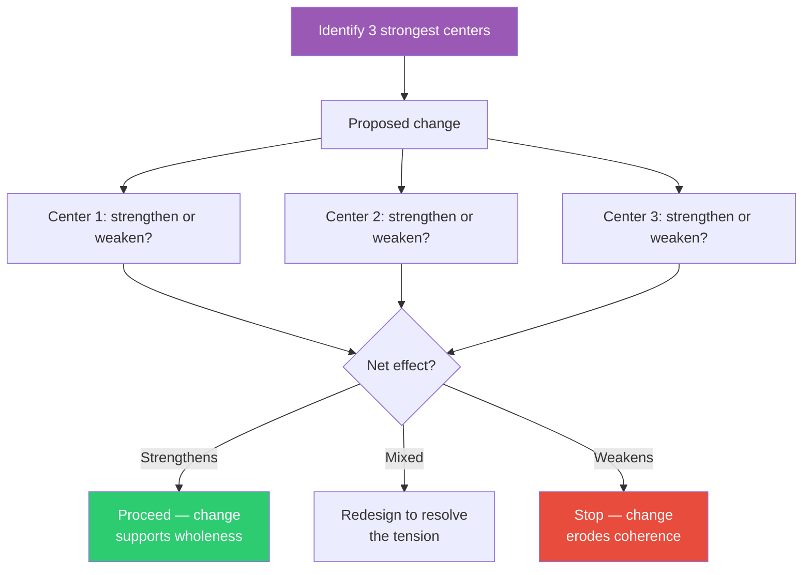

## The Move

Before making a change, identify the {{count}} strongest "centers" in your system — the parts that generate coherence, the elements everything else orbits around, the pieces that make the system feel like itself. These might be a core data model, a key abstraction, a naming convention, a primary user flow, or an architectural invariant. Write them down. Now evaluate your proposed change against each center: does this change STRENGTHEN the center (intensify it, make it more coherent, extend its influence) or WEAKEN it (dilute it, contradict it, create a competing center)? Good changes strengthen existing centers. Destructive changes create new centers that compete with old ones.

## When to Use

- Before a refactor, to check whether it improves or damages structural coherence
- When a system that used to feel clean has gradually become messy — the centers have been weakened
- Before adding a new feature, to verify it integrates with the existing centers rather than fighting them
- When evaluating competing designs — which one respects the existing centers more?
- When a change "works" locally but you sense it harms the whole

## Diagram

## Example

**Situation:** An e-commerce platform has grown organically. The team wants to add a "social shopping" feature (shared carts, friend recommendations, activity feeds). The three strongest centers are:

1. **The Product Catalog** — the single source of truth for what's available, with clean APIs that everything queries.
2. **The Checkout Flow** — a linear, predictable path from cart to payment to confirmation. Users trust it.
3. **The Customer Account** — one identity, one order history, one set of preferences.

**Evaluating "shared carts":**
- Product Catalog: Neutral. Shared carts still reference catalog items.
- Checkout Flow: WEAKENS. Shared carts introduce ambiguity — who pays? What if someone adds items after checkout starts? The linear flow becomes branching.
- Customer Account: WEAKENS. A shared cart blurs ownership. Whose order history does it appear in?

**Redesign:** Instead of shared carts (which fight two centers), implement a "wishlist sharing" feature. Wishlists are social but don't enter the checkout flow until a single customer claims items into their own cart. This strengthens the Product Catalog center (wishlists are another way to browse products) while preserving Checkout and Account.

## Watch Out For

- Centers are not the same as "the most complex parts." A center is the part that gives coherence — it might be simple. A well-designed URL scheme can be a center. A naming convention can be a center
- If you can't identify three strong centers, the system may not have them — which is itself a diagnosis. The system feels incoherent because nothing is generating coherence
- Beware of fossilized centers. Sometimes a center that USED to be strong is now holding the system back. Alexander's test: does strengthening this center make the WHOLE more alive? If strengthening it makes everything else worse, it's no longer a true center — it's a relic
- This is a conservative heuristic. It biases toward preserving existing structure. Sometimes you need to deliberately destroy a center to create a better one — but do it knowingly, not accidentally
