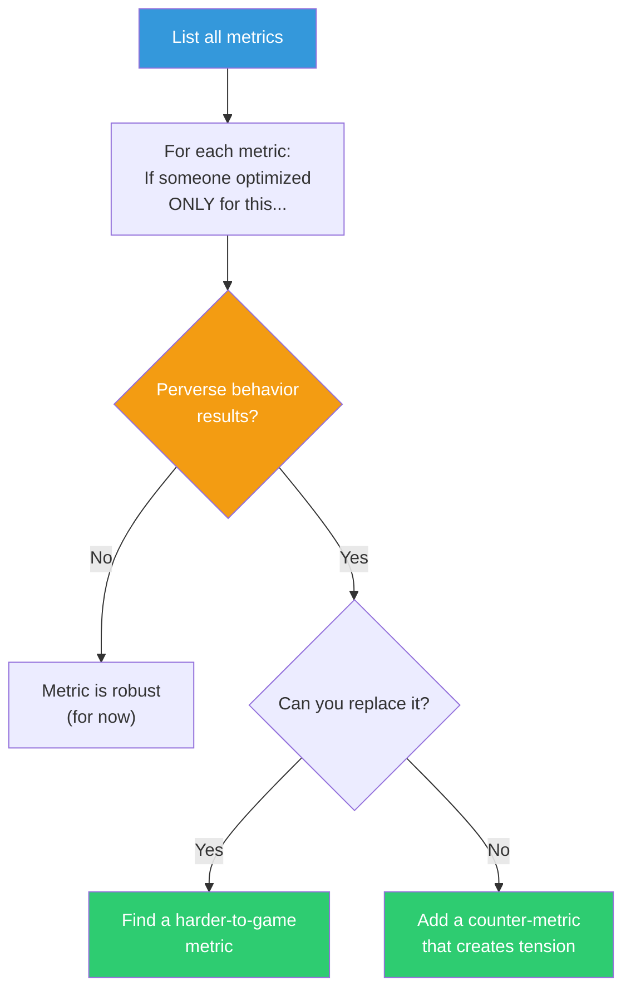

## The Move

List every metric or KPI your solution tracks. If {{persona.1}} were gaming this metric, what would they do? For each one, complete the sentence: "If someone optimized ONLY for this number, ignoring everything else, they would..." If the resulting behavior is perverse, the metric is gameable and will eventually be gamed. Either replace it with a metric that is harder to corrupt, or pair it with a counter-metric that creates productive tension (e.g., speed paired with error rate).

## When to Use

- You are defining success metrics for a feature or project
- A metric is improving but the user experience is degrading
- You suspect a team is optimizing for the scorecard, not the outcome
- You are designing incentive structures, OKRs, or automated alerts

## Diagram

## Example

**Situation:** A platform team picks three metrics for their new developer portal.

| Metric | "If someone optimized only for this..." | Verdict |
|---|---|---|
| Number of API docs pages | They'd split every page into tiny fragments to inflate count | Gameable |
| Time-to-first-API-call for new devs | They'd auto-generate a trivial "hello world" call and count it | Gameable |
| Support tickets filed per 100 new developers | They'd make filing tickets harder, not docs better | Perverse |

**After Goodhart Check:**
- Replace page count with "% of endpoints with complete, tested examples"
- Replace time-to-first-call with "% of devs who make a second call within 24 hours" (shows real engagement, not synthetic)
- Replace ticket count with "% of devs who self-served to resolution" (measured via docs search-to-success funnel)

Each new metric is harder to game because it measures the outcome, not the proxy.

## Watch Out For

- Every metric is gameable at some level. The goal is not perfection but raising the cost of gaming above the benefit
- Counter-metrics can create paralysis if they're perfectly opposed. Ensure there exists a real behavior that improves both
- Don't add so many metrics that nobody can optimize for anything. Three to five metrics with natural tension is the sweet spot
- This check should be repeated periodically. Gaming behaviors evolve as people learn the system
