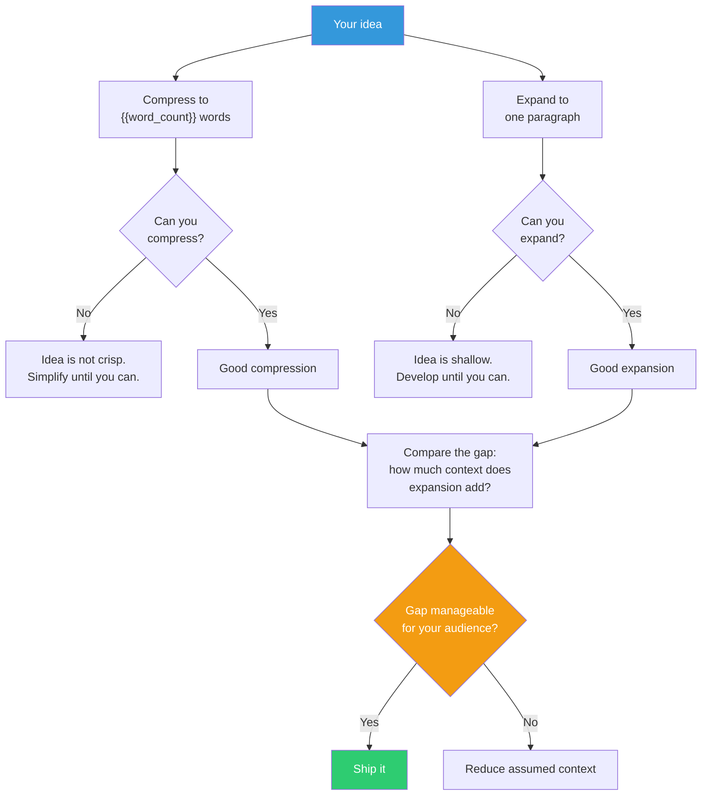

## The Move

Write your idea in exactly **{{word_count}} words**. No cheating with hyphens or compound words. Then expand those {{word_count}} words into one full paragraph that a stranger could act on. If you cannot compress, the idea is not crisp enough — you do not truly know what it is. If you cannot expand, the idea is not rich enough — there is nothing underneath the slogan. The gap between the compressed and expanded versions is the "exformation" — the shared context you are relying on your audience to supply. If that gap is too large, your audience will unzip the message wrong.

## When to Use

- Before presenting an idea to stakeholders
- When a document keeps growing but clarity is not improving
- When people consistently misunderstand your proposal
- As a final check before committing to a direction

## Diagram

## Example

**Idea:** A feature flag system for the platform team.

**Compressed (5 words):** "Decouple deployment from feature release."

**Expanded:** "Build a feature flag service that lets any team ship code to production without exposing it to users, then gradually roll out features by percentage, user segment, or geography — so deployment is a technical event and launch is a business decision, and the two never have to happen at the same time."

**Gap analysis:** The compressed version assumes the reader knows what "decouple" means in this context and why deployment and release being coupled is a problem. For engineers, the gap is fine — they'll unzip it correctly. For the VP of Product, you need to add: "This means we can ship every day without risk, and Product controls when users see new things." Different audiences need different expansion levels.

## Watch Out For

- The compression should capture the core *insight*, not just the category. "Better notifications" is a label, not a compression. "Notify only when action is needed" is a compression
- If you can compress to {{word_count}} words in five different ways that lead to different solutions, you have multiple ideas pretending to be one. Split them
- This is a test of understanding, not a writing exercise. If the compression is poetic but misleading, it fails
- Don't confuse brevity with clarity. A compressed version that requires a decoder ring is worse than a slightly longer version that's self-evident
