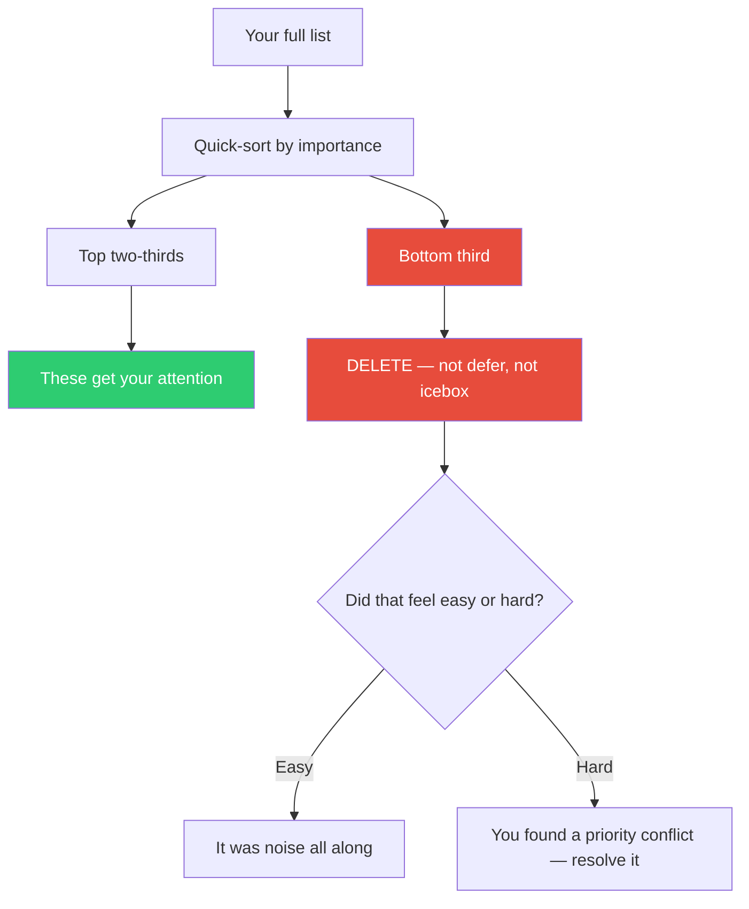

## The Move

Take your list — features, bugs, feedback, action items, whatever you are responding to. Sort it by importance (gut feeling is fine — speed matters here). Draw a line at the bottom {{percent}}%. Everything below that line: delete it. Not "move to icebox." Not "revisit next quarter." Delete. Gone. The act of deletion is the move. Monk's insight was that musicians who respond to every musical moment produce noise, not music. Emphasis requires silence. Priority requires neglect.

## When to Use

- Your backlog, task list, or feedback pile has grown past the point of usefulness
- You feel pressure to respond to every request, comment, or issue
- The team is busy on everything and finishing nothing
- You just finished a brainstorm or retro and have 20 action items

## Diagram

## Example

**Situation:** After a sprint retro, the team has 12 action items:
1. Improve test coverage for auth module
2. Document the deployment process
3. Fix flaky CI test in payments
4. Add dark mode support
5. Refactor the notification service
6. Update onboarding flow copy
7. Investigate memory leak in worker
8. Add CSV export to reports
9. Create style guide for new components
10. Migrate to new logging library
11. Add keyboard shortcuts
12. Write ADR for database choice

**Bottom third (items 9-12):** Style guide, logging migration, keyboard shortcuts, ADR for a decision already made.

**Delete them.** Not "someday." Gone from the list.

**What you learn:** The style guide felt hard to delete — it keeps coming up. That means it is actually competing with the top-third items and deserves a real priority decision, not a backlog slot. The other three were carried forward from previous retros and nobody missed them. They were list-weight, not work.

**Result:** The team focuses on 8 items instead of 12. The style guide gets an honest conversation about priority instead of sitting at position 9 where it will never be reached.

## Watch Out For

- This is a snap move. Do not spend 30 minutes deciding what to delete — that defeats the purpose. Sort fast, cut fast
- If you cannot bring yourself to delete anything, that is the signal: you have no priorities, only a list
- Deleted items that were truly important will come back on their own. Things that matter reassert themselves. Things that do not matter stay gone
- Do not use this as an excuse to ignore legitimate problems. The bottom third should be low-importance, not low-effort. A critical bug is not "something to let go by"
