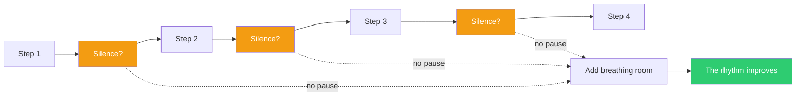

## The Move

Map the rhythm of your solution — the steps, screens, interactions, or phases a user moves through. Mark every transition point where the user shifts from one activity to another. Now ask at each transition: is there silence here? A pause, a confirmation, whitespace, a moment to absorb what just happened before the next thing starts? If you find three or more transitions with no silence, your solution has no phrasing — it is a wall of sound. Add one deliberate pause. Then ask: did the whole thing just get better?

## When to Use

- Users report feeling overwhelmed but cannot articulate what specifically is wrong
- Your onboarding flow or wizard moves directly from step to step with no breathing room
- The dashboard shows everything at once with no visual hierarchy or whitespace
- The CI/CD pipeline runs 14 steps back-to-back with no human checkpoint

## Diagram

## Example

**Situation:** Your SaaS onboarding flow has 7 steps: Sign up, verify email, choose plan, enter payment, create workspace, invite team, configure integrations. Users complete signup but 40% drop off before finishing onboarding.

**Rhythm audit:** Every step immediately launches the next. Choose plan flows directly into payment. Payment flows directly into workspace creation. There is no silence anywhere — it is a 7-step gauntlet.

**Adding silence:** After "create workspace," insert a success screen. Just: "Your workspace is ready. [workspace name] with a checkmark." No call to action for 3 seconds, then a gentle "Next: invite your team" button appears. After "invite team," show the workspace — empty but real. Let the user SEE the space before being asked to configure it.

**Result:** The two pauses transform the experience from "fill out 7 forms" into "sign up, set up, arrive." The success screen after workspace creation is the most important silence — it turns a chore into an accomplishment. Drop-off decreases because users feel progress instead of pressure.

## Watch Out For

- Do not confuse silence with friction. A loading spinner is not silence — it is waiting. Silence is an intentional pause that serves the user, not the system
- Too much silence becomes sluggish. One or two well-placed pauses in a flow are phrasing; pauses after every step is a stuttering experience
- This applies to code and processes too, not just UI. A deployment pipeline with a manual approval gate after the staging deploy is "silence" — a moment to observe before proceeding
- Silence is culturally dependent. Some user populations expect density and interpret whitespace as emptiness. Know your audience
