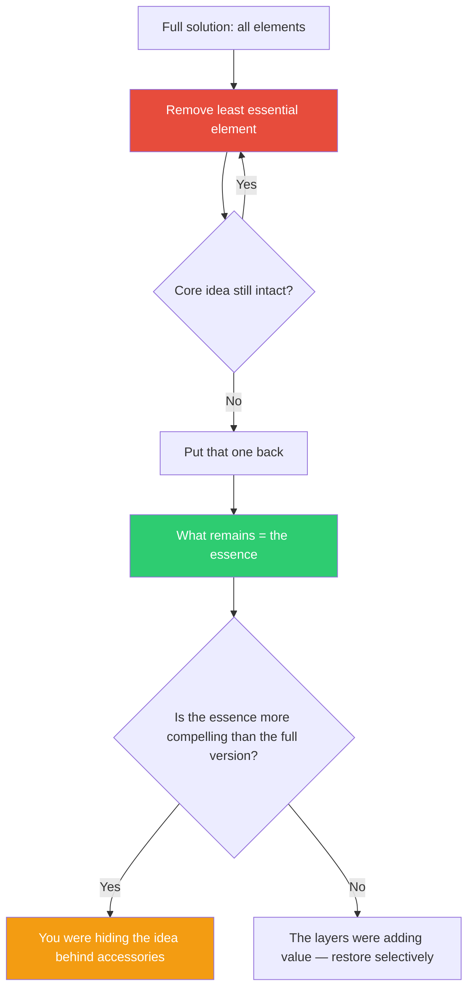

## The Move

List every component, feature, or element in your solution. Your target: reduce to **{{number}}** elements. Starting from the least essential, remove one element. Ask: "Is the core idea still intact?" If yes, remove the next. Keep removing until you have exactly {{number}} elements left — or until the next removal would destroy the core, whichever comes first. If you cannot get down to {{number}}, that tells you the minimum viable set is larger than you thought. If you blow past {{number}} and the idea still holds, you had even more decoration than expected. What remains is the essence. Everything you removed was either decoration, insurance, or habit.

## When to Use

- The solution has accumulated layers and you have lost sight of the core
- You need to explain the idea simply and cannot
- Users or stakeholders seem confused by what should be straightforward
- You suspect the project has scope-crept past its original insight

## Diagram

## Example

**Situation:** You have built a developer productivity dashboard with 8 panels: build times, deploy frequency, error rates, PR review time, code coverage, sprint velocity, incident count, and team happiness survey.

**Reduction sequence:**
1. Remove team happiness survey. Core intact? Yes.
2. Remove sprint velocity. Core intact? Yes.
3. Remove code coverage. Core intact? Yes.
4. Remove incident count. Core intact? Yes — it overlaps with error rates.
5. Remove PR review time. Core intact? Hmm, yes — it's useful but not the core insight.
6. Remove deploy frequency. Core intact? Barely — this is getting thin.
7. Remove error rates. Core intact? No — without error rates AND build times, there is no "productivity signal."

**The essence:** Build times + deploy frequency + error rates. Three panels. These are the core feedback loop: how fast can we ship, how often do we ship, and what breaks when we ship.

**What you learn:** The original 8-panel dashboard was a "dashboard of dashboards" — it showed everything but said nothing. The 3-panel version has a narrative: speed, frequency, quality. The other 5 panels can exist as drill-downs, but the landing page should be the essence.

## Watch Out For

- Reduction is not the same as simplification. Simplification makes things easier; reduction makes things starker. The essence may be uncomfortable in its nakedness
- If you reach the "core intact?" question and always answer yes, your solution may not have a core. That is the most important finding of this exercise
- Do not confuse "I like this element" with "this element is essential." Rick Rubin regularly strips away parts that the artist loves but the song does not need
- After finding the essence, you may add some elements back. But now you add them knowingly, as chosen enhancements, not unexamined defaults
