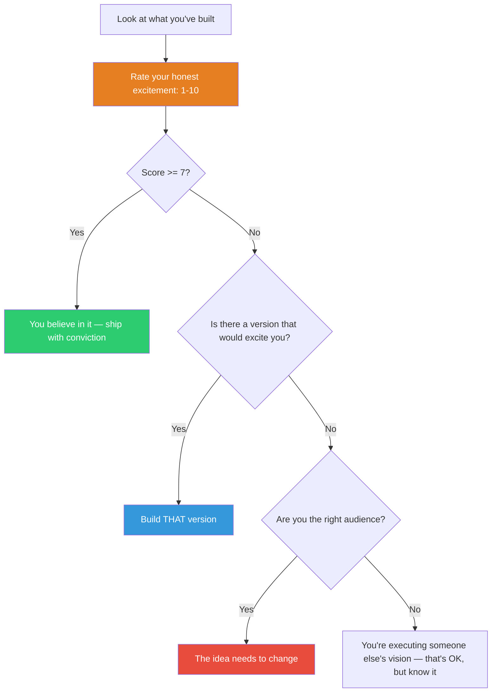

## The Move

Step back from the builder's seat and sit in the audience. Look at what you have built (or are building) as if you encountered it for the first time. Ask yourself one question: on a scale of 1 to 10, how excited am I about this? Not "how excited should the target user be" — how excited are YOU? If the answer is below 7, you have a problem that no amount of user research will fix. You are building something you do not believe in. Either find the version that would make you say "I need this," or accept that you are executing someone else's vision and adjust your expectations accordingly.

## When to Use

- You are deep in execution and have lost touch with whether the thing is good
- User research says "build X" but the team is going through the motions
- You are about to ship and feel relief rather than pride
- The product has been designed by committee and optimized for consensus

## Diagram

## Example

**Situation:** Your team has spent 6 weeks building a "smart notification digest" feature. User research showed that users are overwhelmed by notifications and want a daily summary. The spec is solid. The implementation is clean. You are about to ship.

**Be the First Audience:** You ask yourself — would I turn this on? Honest answer: 4 out of 10. Why? Because a daily digest means you see notifications 12 hours late. The real problem is not volume — it is interruption. You do not want fewer notifications. You want notifications that know when to be quiet and when to be loud.

**The version that would excite you:** Instead of a digest, a notification system that classifies urgency in real-time: truly urgent things interrupt you immediately; everything else batches until you're between tasks (detected by activity gaps). Not a digest — a traffic controller.

**Result:** The team pivots from "daily digest" to "smart notification routing." The feature is harder to build but the team is energized because everyone agrees: "I would actually use this." The user research was right about the problem (notification overwhelm) but wrong about the solution (batching by time instead of by urgency).

## Watch Out For

- Your taste is not infallible. A score below 7 is a signal to investigate, not an automatic veto. Check whether your lack of excitement is about the idea or about your fatigue
- This move can become an excuse for ego-driven design. "I wouldn't use it" does not mean "nobody would use it." But if YOU wouldn't use it and you are the target audience, pay attention
- Do not fake your score. A 5 that you talk yourself into a 7 is worse than an honest 5
- If you consistently rate everything below 7, the problem is your mood or standards, not the work. Calibrate against things you have built that you ARE proud of
