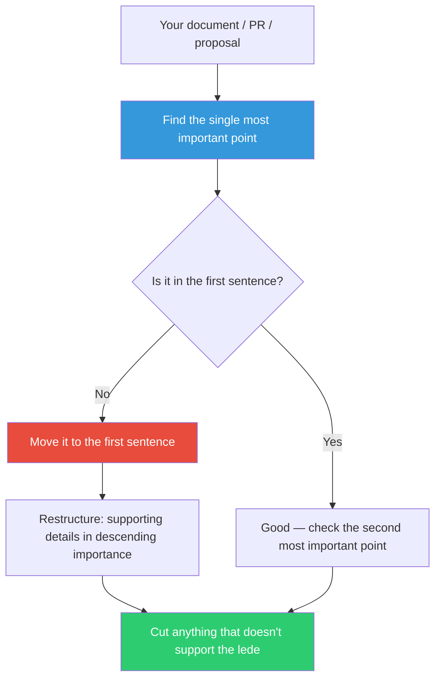

## The Move

Take your solution, document, PR, proposal, or plan. Read it from the top. Ask: if the reader stopped after the first sentence, would they know the most important thing? If not, find where the most important thing actually lives — paragraph three, bullet seven, the appendix — and move it to the first sentence. Restructure everything else as supporting detail in descending order of importance. If this were a {{genre.1}}, where would the lede be?

Journalists call this the inverted pyramid: lead with the conclusion, then supporting facts, then background. Readers (and code reviewers, and stakeholders) can stop at any point and still have the most important information.

## When to Use

- Before submitting a PR, design doc, or proposal for review
- When feedback keeps missing the point — the point is probably buried
- When you notice your writing starts with context, history, or setup before the key insight
- When a document exceeds one page and you are not sure what to cut

## Diagram

## Example

**Before (buried lede):**

> "In Q3, we evaluated several caching strategies for the catalog service. We considered Redis, Memcached, and an in-memory LRU cache. After benchmarking each option under production-like load, measuring hit rates, tail latency, and operational complexity, we determined that..."

The reader is four lines in and still does not know the answer.

**After (lede first):**

> "We are migrating the catalog cache from Memcached to Redis, reducing P95 latency from 45ms to 12ms. Here is why, and the migration plan."

Now the reader knows the decision, the impact, and what follows — in one sentence. Everything else is supporting detail they can read or skip.

**Applied to code:** A function that validates input, transforms data, calls three services, and then on line 47 returns the actual result. The "lede" — the core purpose — is buried. Restructure: extract the validation and transformation into named helpers so the main function reads as a clear sequence of what matters.

## Watch Out For

- The lede is not always what you worked hardest on — it is what the READER needs most. Your three-week investigation is context; the one-line recommendation is the lede
- Different audiences have different ledes. A technical lede ("switch to Redis") differs from an executive lede ("cut latency by 73%"). Know your audience
- Do not confuse "bury the lede" with "leave out the details." The inverted pyramid keeps all the details — it just reorders them so the most important come first
- If you struggle to identify the single most important point, that may indicate the work itself lacks focus, not just the writing
