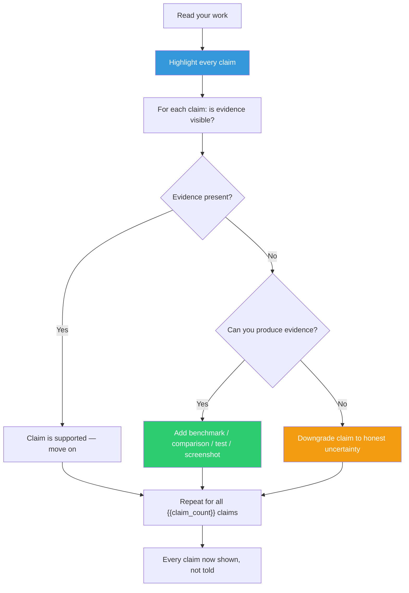

## The Move

Read through your solution, design doc, PR, or proposal. Highlight every claim — explicit or implicit. "This is simpler." "Performance improves." "The API is intuitive." "This scales well." You are looking for {{claim_count}} claims. For each claim, ask: is there visible evidence RIGHT HERE, or am I asking the reader to take my word for it? For every unsupported claim, either add the evidence (a benchmark, a comparison, a diagram, a test result) or downgrade the claim to an honest uncertainty ("we believe this will be faster, pending benchmarks").

Chekhov's rule was: don't tell me the moon is shining — show me the glint of light on broken glass. In technical work, don't tell me the solution is good — show me the numbers, the diff, the before-and-after.

## When to Use

- Before submitting a design doc or proposal for review
- When feedback comes back as "I'm not convinced" without specific objections — the objection is lack of evidence
- When you notice adjectives doing the heavy lifting in your writing (fast, simple, clean, elegant, robust)
- When evaluating someone else's proposal and it sounds good but you cannot point to why

## Diagram

## Example

**Design doc excerpt (telling):**

> "The new query engine is significantly faster than the current implementation. The code is cleaner and more maintainable. It handles edge cases more gracefully."

**Audit — three claims found:**
1. "Significantly faster" — No benchmark. No numbers. UNSUPPORTED.
2. "Cleaner and more maintainable" — No comparison. No metric. UNSUPPORTED.
3. "Handles edge cases more gracefully" — No examples. No test output. UNSUPPORTED.

**After (showing):**

> "The new query engine processes the benchmark suite in 340ms vs. 1,200ms for the current implementation (3.5x improvement; benchmark script in /benchmarks/query_engine.sh). The rewrite reduces the query planner from 1,400 lines across 6 files to 600 lines in 2 files, eliminating the visitor pattern indirection that caused 8 of our last 12 bugs in this module. It handles the NULL-in-subquery edge case (issue #4521) and the empty-result-set case (issue #4087) — both have regression tests in the PR."

Same three claims, now shown with numbers, file paths, issue references, and test coverage.

## Watch Out For

- Not every claim needs a rigorous proof. A line-count comparison is enough to "show" simplicity. A screenshot is enough to "show" a UI improvement. Match evidence to stakes
- Watch for implicit claims. Choosing a technology implies "this is the best choice" — that is a claim that needs showing
- Showing takes more work than telling. That is the point. If you cannot produce evidence for a claim, the claim might be wrong
- Do not over-show. A two-page benchmark appendix for a minor optimization is showing off, not showing. Evidence should be proportional to the claim's importance
