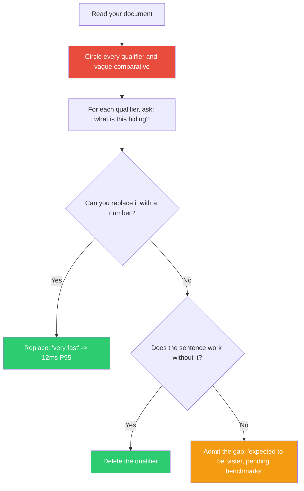

## The Move

Read through your document, design, plan, or PR description. Circle every qualifier: "very," "highly," "extremely," "really," "significantly," "quite," "fairly," "substantially," "remarkably." Also catch comparative adverbs without a baseline: "faster," "simpler," "cleaner," "more scalable" — faster than WHAT?

Each qualifier is a diagnostic marker. It reveals a spot where the underlying claim is weak and you are using emphasis as a substitute for evidence. For each one, do one of three things: (1) replace it with a specific number — "very fast" becomes "responds in 12ms"; (2) remove it entirely — if the sentence works without the qualifier, it was filler; (3) admit the gap — "we expect this to be faster but have not benchmarked it yet."

## When to Use

- As a final pass before submitting any written artifact for review
- When your writing sounds enthusiastic but vague
- When reviewers keep asking for specifics — the adverbs are telling you where
- When evaluating someone else's proposal and it feels like marketing rather than engineering

## Diagram

## Example

**Before — a design proposal full of adverbs:**

> "The new architecture is significantly more scalable and substantially reduces latency. The codebase is much cleaner and the deployment process is considerably simpler. This approach is far more maintainable than the current system."

**Adverb audit:**
| Qualifier | What it's hiding | Fix |
|-----------|-----------------|-----|
| "significantly more scalable" | No throughput numbers | "Handles 50K RPS vs. current 8K RPS" |
| "substantially reduces latency" | No latency numbers | "P95 drops from 800ms to 120ms" |
| "much cleaner" | No comparison metric | "Reduces from 14 modules to 5" |
| "considerably simpler" | No specifics | "One-command deploy vs. current 7-step runbook" |
| "far more maintainable" | No evidence at all | Remove — the other numbers already show this |

**After:**

> "The new architecture handles 50K RPS (vs. current 8K) and drops P95 latency from 800ms to 120ms. The codebase consolidates 14 modules into 5, and deployment goes from a 7-step runbook to a single command."

Shorter, more convincing, and every claim is verifiable. The adverbs were occupying space where numbers belonged.

## Watch Out For

- Not all qualifiers are bad. "Roughly 500ms" is honest hedging. "Very roughly 500ms" is an adverb masking uncertainty about the number itself
- This move applies to code comments and variable names too. A function called `fastSort` or `improvedHandler` uses adverbs in code — fast compared to what? Improved how?
- Killing adverbs sometimes reveals that you do not have the data. That is the real finding. Go get the data before writing the claim
- Do not replace adverbs with false precision. "Approximately 3x faster" is better than "2.97x faster" if you have not run a rigorous benchmark
