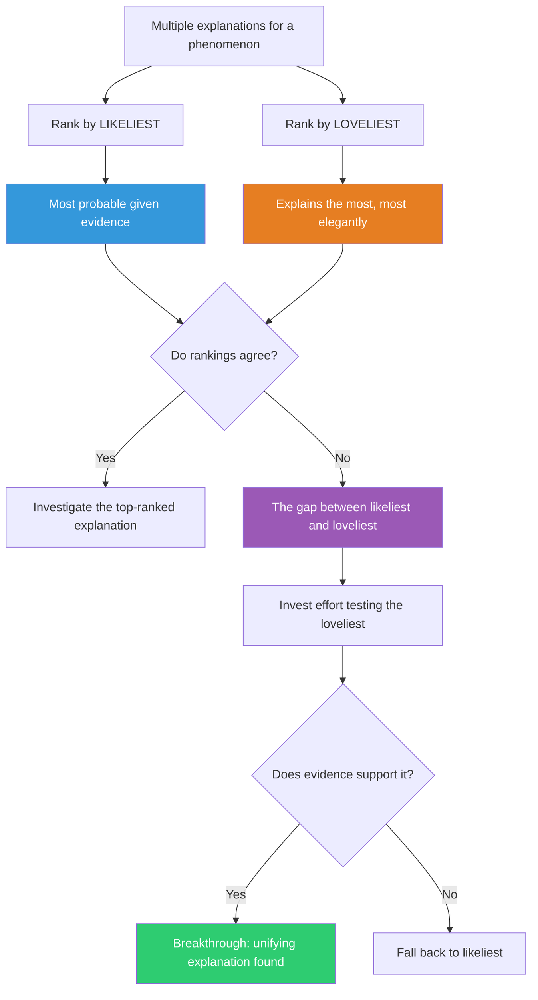

## The Move

You have multiple explanations for a phenomenon. **Rank them by likeliest** — most probable given your current evidence and priors. Now **separately rank by loveliest** — which explanation, if true, would explain the most other puzzling things with the most elegance? The likeliest explanation is the safe bet. The loveliest is the high-value investigation target. What explanation would someone in {{domain.1}} find loveliest? When the two rankings diverge — when the loveliest explanation is not the likeliest — that gap is where breakthrough understanding hides. Invest investigation time proportional to the explanatory payoff, not just the prior probability.

## When to Use

- When you have a plausible explanation but it only accounts for one symptom
- When multiple small problems each have separate explanations and you suspect a deeper connection
- When choosing between hypotheses to investigate and you want to allocate effort wisely
- When the probable explanation feels unsatisfying or superficial

## Diagram

## Example

**Situation:** Your application has three unrelated problems filed as separate bugs:
1. Search results occasionally return stale data (filed 2 weeks ago)
2. User profile updates sometimes don't persist (filed 1 week ago)
3. Dashboard analytics show counts that don't match the database (filed 3 days ago)

**Likeliest explanations (ranked):**
1. Bug #1: Cache TTL is too long. (Likely — simple, common.)
2. Bug #2: Race condition in the update endpoint. (Likely — reported intermittently.)
3. Bug #3: Analytics aggregation job has a counting bug. (Likely — aggregation is tricky.)

Three separate bugs, three separate fixes. Likeliest ranking: investigate each independently.

**Loveliest explanation:**
"All three are symptoms of a replication lag problem. The read replicas fall behind the primary during high write load. Search reads from a replica (stale results). Profile reads-after-writes hit a replica (lost updates). Analytics queries run against a replica (stale counts)."

If this single explanation is true, it explains all three bugs, their intermittent nature, and why they all appeared in the last two weeks (when you scaled up write traffic). One root cause, one fix (read-your-writes consistency or replica lag monitoring), three bugs closed.

**The gap:** The likeliest path is three separate investigations consuming a combined 3 sprints. The loveliest path is one investigation consuming 2 days. Test the loveliest first: run a query against the primary and a replica simultaneously during peak load. If they diverge, you found the root cause. If they don't, fall back to the three-bug approach.

## Watch Out For

- Loveliness is not wishful thinking. A lovely explanation must be *testable* and must concretely predict observable consequences. "Everything is connected" is not lovely — it's vague.
- The loveliest explanation is often less likely precisely because it's more ambitious. That's fine. The expected value of investigating it can still be higher because the payoff of being right is much larger.
- Don't confuse elegance with simplicity. The loveliest explanation isn't always the simplest — it's the one with the most unifying power. Sometimes a moderately complex explanation that connects five puzzles beats a simple one that explains only one.
- If you can't test the loveliest explanation cheaply, don't abandon the likeliest. Pursue both in parallel — test the lovely one with a quick experiment while fixing the likeliest bug as a hedge.
