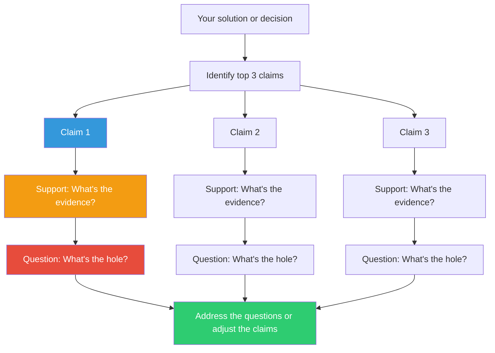

## The Move

Do this for your top {{count}} claims. Identify the most important claims you're making about your solution (or decision, or design). For each one, run this sequence: **CLAIM** — state it in one sentence. "This approach will scale to 10x current load." **SUPPORT** — what is your evidence? "We benchmarked it at 10x with synthetic traffic and p99 stayed under 200ms." **QUESTION** — poke a hole in either the claim or the support. "But the benchmark used uniform request sizes. Real traffic has a long tail of large payloads — would p99 hold?" Any claim without support is an assertion. Any supported claim without a question is unexamined. Do all three for each of your three most important claims.

## When to Use

- You're about to present a technical decision and want to pre-check your reasoning
- The team reached consensus quickly and you want to verify it's grounded
- You're writing an RFC or design doc and need to audit your own arguments
- Decisions are being made based on assertions rather than evidence

## Diagram

## Example

**Situation:** You're proposing migrating the monolith's user service to a standalone microservice. You need to present the case to the architecture review board.

**Claim 1:** "Extracting the user service will let the user team deploy independently, reducing deploy cycle time from 2 weeks to 2 days."
- **Support:** The user team's changes currently wait in the monolith's release train. Their changes are typically ready 8-10 days before they ship.
- **Question:** Will they actually deploy independently, or will they still coordinate with the monolith because the user service has 14 synchronous callers that break on schema changes?

**Claim 2:** "The migration can be done incrementally with a strangler fig pattern over 6 weeks."
- **Support:** We've identified 23 endpoints to extract. The team extracted a similar-sized billing module in 5 weeks last quarter.
- **Question:** The billing module had 3 callers. The user module has 14 callers across 6 teams. Is the complexity linear in endpoints or exponential in callers?

**Claim 3:** "Operational overhead will be minimal because we'll use the existing Kubernetes platform."
- **Support:** The platform team confirmed the user service fits within current cluster capacity.
- **Question:** "Operational overhead" includes on-call, monitoring, runbooks, and cross-service debugging — not just hosting. Who owns the on-call rotation for a new service, and do they have the tooling to debug distributed traces?

**Result:** Claim 1's question reveals the migration might not achieve its goal without decoupling the callers first. This changes the project scope fundamentally — and it's better to discover this in a 10-minute exercise than 4 weeks into the migration.

## Watch Out For

- The Question must be genuine, not performative. "Is there any risk?" is useless. "Would p99 hold under long-tail payloads?" is specific and testable
- If you cannot state the Support for a claim, you don't have a claim — you have a hope. That's the most important discovery this move produces
- The temptation is to answer the Question immediately and dismiss it. Resist. Sit with the question. If you can answer it instantly, it wasn't a good enough question
- Three claims is a forcing function. If you have ten claims, pick the three your decision depends on most. If you can't prioritize, that's a separate problem
