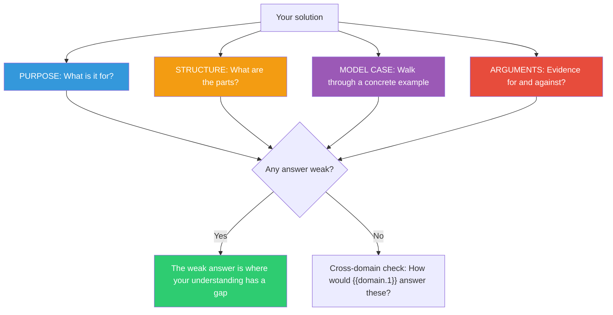

## The Move

Treat your solution, tool, or concept as a deliberate DESIGN and answer four questions. (1) **PURPOSE:** What is it for? What problem does it solve and for whom? If you can't state the purpose in one sentence, you don't understand it yet. (2) **STRUCTURE:** What are its parts and how do they relate? Draw it. Name the components. (3) **MODEL CASES:** What is one clear example of it working as intended? Walk through the happy path concretely. (4) **ARGUMENTS:** What's the evidence for this design? What's the evidence against it? Any answer weak on one of these four questions has a gap. Then ask: how would someone in **{{domain.1}}** answer these four questions about their version of this problem?

## When to Use

- You need to evaluate whether a solution is sound, not just whether it works
- You're writing a design doc or RFC and want a structured framework
- You can build it but can't explain it — a sign of shallow understanding
- You're comparing two competing approaches and need a consistent evaluation lens

## Diagram

## Example

**Situation:** You've designed a feature flag system for gradual rollouts. You need to present it to the team.

**(1) PURPOSE:** Enable product teams to roll out features to a percentage of users, with instant kill-switch capability, without requiring a deploy. Audience: product engineers who don't want to manage infrastructure.

**(2) STRUCTURE:** Three components: a **Flag Store** (key-value database mapping flag names to rollout rules), a **SDK** (client library that evaluates flags locally using cached rules), and an **Admin UI** (dashboard for creating/modifying flags and viewing rollout status). The SDK polls the Flag Store every 30 seconds for rule updates.

**(3) MODEL CASE:** Engineer creates flag `new-checkout-v2` in the Admin UI, sets rollout to 5% of users using consistent hashing on user ID. SDK in the checkout service evaluates the flag on each request. Engineer monitors error rates, bumps to 25%, then 100% over three days. On day two at 50%, error rate spikes — engineer hits kill switch in Admin UI, flag goes to 0% within 30 seconds (next SDK poll).

**(4) ARGUMENTS:**
- **For:** Decouples deployment from release. Consistent hashing means the same user always sees the same variant. 30-second polling means near-instant rollback without a deploy.
- **Against:** 30-second polling means up to 30 seconds of stale flags after a kill switch — is that acceptable for safety-critical features? Local evaluation means the SDK must have all user attributes available — what about server-side flags that depend on data the client doesn't have? No audit log in the current design — who changed what flag when?

**Cross-domain lens ({{domain.1}}):** How would someone in this domain handle the equivalent of gradual rollout with instant rollback? What can you import from their approach?

**Result:** The Arguments phase surfaced three real gaps: staleness on kill-switch, missing server-side attribute support, and no audit trail. Two of these are fixable before launch. The third (staleness) requires a design decision about push vs. poll that affects the entire architecture.

## Watch Out For

- Purpose seems obvious but is often unstated or vague. "It's a feature flag system" is not a purpose. "It lets product engineers roll out features without deploys" is. The purpose constrains the design — if you can't state it, you can't evaluate the design against it
- Model Cases must be concrete, not hypothetical. Walk through specific data, specific user actions, specific system responses. Abstract model cases hide flaws
- The Arguments section should be adversarial. If you can't find evidence against your design, you haven't looked hard enough. Every design has trade-offs
- The cross-domain question is not decorative. Practitioners in other fields have often solved the structural equivalent of your problem with entirely different patterns. Take it seriously
