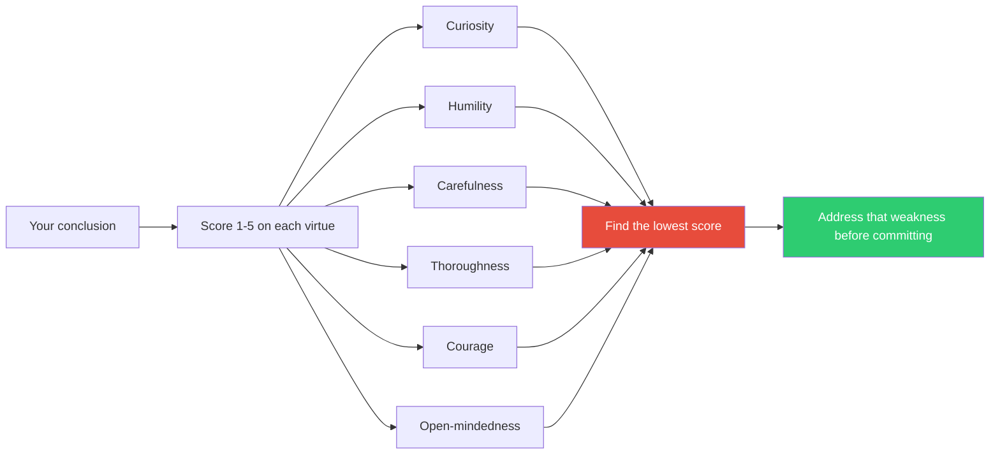

## The Move

Before committing to a conclusion or decision, score yourself 1-5 on each of Baehr's six intellectual virtues: (1) **Curiosity** — did I explore enough, or did I grab the first workable answer? (2) **Humility** — am I owning what I do not know? (3) **Carefulness** — was I precise with evidence, or sloppy with details? (4) **Thoroughness** — did I check enough sources, scenarios, edge cases? (5) **Courage** — did I consider uncomfortable possibilities, or avoid them? (6) **Open-mindedness** — did I genuinely consider alternatives, or just confirm my initial instinct? Your lowest score is your vulnerability. How would {{thinker.1}} score you on these virtues? Address that specific weakness before proceeding.

## When to Use

- Before presenting a recommendation or making a final decision
- When you feel confident but have not examined why
- As a team retrospective tool after a design review
- When a decision feels rushed and you want a fast quality check on your reasoning

## Diagram

## Example

**Conclusion:** "We should adopt server-side rendering (SSR) for our Next.js app to improve SEO and initial load time."

**Virtue check:**

| Virtue | Score | Honest Assessment |
|--------|-------|-------------------|
| Curiosity | 4 | I read several articles, watched talks, explored the docs. |
| Humility | 3 | I don't actually know our SEO baseline. I assumed it's bad. |
| Carefulness | 2 | I haven't measured current load times. "Improve" is vague. |
| Thoroughness | 3 | I compared SSR vs. SSG but didn't look at ISR or streaming. |
| Courage | 2 | I didn't consider that SSR might make things worse — higher TTFB, more server cost, cold start latency on serverless. |
| Open-mindedness | 3 | I briefly considered alternatives but kept coming back to SSR. |

**Lowest scores:** Carefulness (2) and Courage (2).

**Action:** Before committing, (a) measure actual current load times and SEO crawl coverage (carefulness), and (b) seriously model the scenario where SSR degrades performance — what does TTFB look like under load on our infrastructure? (courage). These two steps take a day and could prevent a month-long migration to something that makes things worse.

## Watch Out For

- Self-assessment is inherently biased. You are using the same mind to evaluate the mind. Where possible, have someone else score you, or at minimum, write down your scores and defend each one out loud
- A score of 5 on everything means you are not being honest. Nobody is perfectly virtuous on every dimension in every decision
- This is a diagnostic tool, not a perfectionism trap. You do not need all 5s to proceed. You need to know where the 1s and 2s are
- Different decisions weight virtues differently. A safety-critical system demands high carefulness and thoroughness. An early-stage exploration demands high curiosity and courage. Context matters
