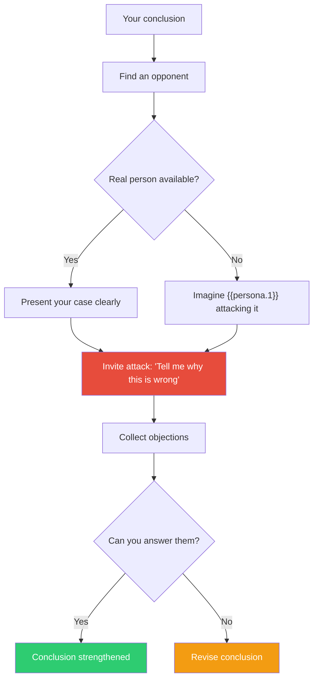

## The Move

Mercier and Sperber's thesis: human reasoning did not evolve to find truth in isolation. It evolved to produce and evaluate arguments in SOCIAL exchange. Reasoning alone, you are a rationalization machine — you generate justifications for what you already believe. Reasoning WITH an opponent, you produce genuine insight — their challenges force you to find real weaknesses and strengthen real arguments. Find someone who will argue against your solution. If no one is available, vividly imagine **{{persona.1}}** doing it. Present your case clearly, then explicitly invite attack: "Tell me why this is wrong." The back-and-forth adversarial exchange is where reasoning works as designed — not in solitary contemplation.

## When to Use

- You have been thinking alone and your conclusion feels too neat
- A team has reached consensus without genuine opposition
- You are about to present a recommendation and want to pre-test it
- You suspect you are rationalizing rather than reasoning

## Diagram

## Example

**Conclusion:** "We should build our own feature flag system instead of using LaunchDarkly because we need custom targeting rules for our ML models."

**Solo reasoning (rationalization mode):** "LaunchDarkly doesn't support our custom targeting. Building our own gives us full control. We have the engineering capacity. It'll take about 3 weeks."

**Argued with a skeptical {{persona.1}} (e.g., a product manager):**

- **Opponent:** "You said 3 weeks. What's the actual track record on 3-week estimates for infrastructure projects?"
- **You:** "...historically they take 2-3x longer. So maybe 6-9 weeks."
- **Opponent:** "In those 6-9 weeks, what features are NOT shipping?"
- **You:** "The personalization rollout and the new onboarding flow."
- **Opponent:** "So you're delaying revenue-impacting features to build infrastructure that a vendor sells for $500/month. Have you actually tried LaunchDarkly's custom attributes feature? Or did you assume it can't do what you need?"
- **You:** "...I assumed. I haven't actually tried it."

**Outcome:** The developer checks LaunchDarkly's custom attributes and discovers it handles 80% of the ML targeting use case out of the box. The remaining 20% can use a thin wrapper. Total integration time: 3 days instead of 6-9 weeks. Solo reasoning produced a rationalization for the more interesting (build) option. Adversarial exchange revealed the assumption (LaunchDarkly can't do this) was untested.

## Watch Out For

- Choose opponents who will genuinely push back, not people who will politely agree. A "devil's advocate" who is not invested in the opposing view is weak medicine
- Do not get defensive. The point is not to win the argument — it is to find the weaknesses in your reasoning. If you "win" every exchange, your opponent is too soft or you are not listening
- Imagined opponents are weaker than real ones. Mercier and Sperber's research shows that real social exchange outperforms simulated debate. Use the imaginary opponent as a fallback, not a preference
- This move works for evaluating conclusions, not for generating ideas. For idea generation, solitary exploration can be effective. Switch to argumentation when you have something to test
