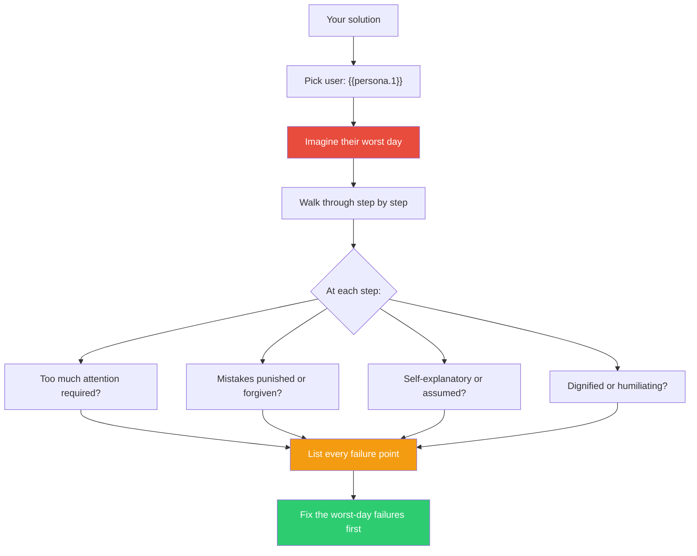

## The Move

You've designed a solution. Now stress-test it against the worst-case user state. Pick a specific user — **{{persona.1}}** — and assume they are at their absolute lowest capacity: exhausted, confused, frustrated, distracted, in a hurry, maybe scared. Do not assume they will be patient, attentive, or knowledgeable. Design for the floor, not the ceiling. Walk your solution through their experience step by step. At each step ask: Does this require more attention than they have right now? Does it punish mistakes or forgive them? Does it explain itself or assume prior knowledge? Does it treat them with dignity?

Write down every point where your worst-case user would fail, stall, or feel stupid. These are not edge cases. These are the moments that define whether your solution is robust under real conditions.

## When to Use

- Before shipping a feature to production — especially auth flows, error handling, onboarding
- When evaluating API design or developer experience
- When the team has been building for power users and hasn't considered newcomers
- After usability testing reveals confusion you didn't expect
- When you've optimized for the happy path and need to stress-test the sad paths

## Diagram

## Example

**Solution:** A CLI tool for database migrations. The developer designed it with clear subcommands: `migrate up`, `migrate down`, `migrate status`, `migrate create <name>`.

**Compassionate reframe:** Imagine a junior developer who just got paged at 2am because production is down. They've been told "just run the migration rollback." They're half-asleep, stressed, and have never used this tool before.

**Walking through their worst day:**
- They type `migrate rollback`. The tool says `Unknown command: rollback`. No suggestion of `migrate down`. On their worst day, this error feels like a wall. **Fix: suggest nearest command.**
- They try `migrate down`. The tool rolls back ONE migration. Production is still broken. They didn't know `down` means "one step" not "undo everything." **Fix: confirm what "down" will do before doing it. Show the specific migration being reversed.**
- They panic and run `migrate down` three more times. Now they've rolled back four migrations, three of which were fine. **Fix: require explicit count for multiple rollbacks. Show what each rollback will undo BEFORE executing.**
- The tool prints `Migration 20240315_add_index rolled back successfully` with no indication of current state. They don't know if production is fixed. **Fix: after rollback, show current migration state and what the schema looks like now.**

**Result:** Four design changes, all invisible on the happy path, all critical at 2am.

## Watch Out For

- Compassionate design is not dumbed-down design. You're not removing power — you're adding guardrails, confirmations, and clarity for when cognitive resources are low
- Don't pick a persona so extreme that every solution fails. The worst day should be realistic, not apocalyptic
- This move reveals what to fix but not how to prioritize. Some worst-day failures are rare; others happen weekly. Assess frequency after identifying the failures
- Compassion includes compassion for future-you. You are also a user of your own code, your own APIs, your own documentation. You will also have a worst day
