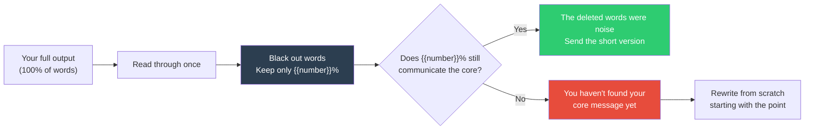

## The Move

Take your output — your plan, your explanation, your code review comment, your proposal, your Slack message. Count the words (roughly is fine). Now delete words until only **{{number}}%** remain. The constraint: you cannot rearrange, rewrite, or add words. You can only BLACK OUT — delete. What survives?

If the surviving **{{number}}%** still communicates the core message, then the deleted words were noise. If it doesn't communicate the message, you haven't found your core message yet — and that's the more important discovery. Deletion is a creative act. Choosing what survives IS the insight.

## When to Use

- Before sending a long email, proposal, or design document
- When a code review comment has grown into a paragraph and you're not sure it should be
- After writing a technical explanation that feels bloated
- When an AI agent produces a verbose response and you need to evaluate whether there's substance underneath
- When you suspect you're writing to think rather than writing to communicate

## Diagram

## Example

**Situation:** A developer writes a PR description:

> "This PR refactors the authentication middleware to use a more efficient token validation approach. Previously, we were making a database call on every single request to verify the JWT token, which was adding approximately 50ms of latency to each API call. After investigating several options including caching the validation results in Redis, using an in-memory LRU cache, and switching to asymmetric key verification, I decided to go with asymmetric key verification because it eliminates the database dependency entirely and allows us to verify tokens using only the public key, which can be loaded once at startup. This change reduces auth latency from ~50ms to ~1ms per request and removes the database as a single point of failure for authentication."

**Word count:** ~120 words. Target: **20%** = ~24 words.

**Blackout result:** "refactors authentication middleware ... database call on every request ... 50ms latency ... asymmetric key verification ... eliminates database dependency ... verify tokens using only the public key ... loaded once at startup ... reduces auth latency from ~50ms to ~1ms ... removes database as single point of failure"

**Condensed version (24 words):** "Replaces per-request DB token validation with asymmetric key verification. Auth latency drops from 50ms to 1ms. Removes DB as auth single point of failure."

**Verdict:** The 24-word version communicates everything a reviewer needs. The other 80% was narrating the thought process, which belongs in comments, not the PR description.

## Watch Out For

- Very low percentages (10-15%) are extreme. Use them to find the single most important sentence, not as a target for your final output
- Context matters. A PR description can be terse; a design doc explaining a novel architecture may legitimately need every word. The test is whether the cut version loses MEANING, not just words
- Don't confuse brevity with clarity. A short but ambiguous message is worse than a longer clear one. The goal is to remove noise, not signal
- This move works best on YOUR output. Using it on someone else's writing is editing; using it on your own is self-awareness
