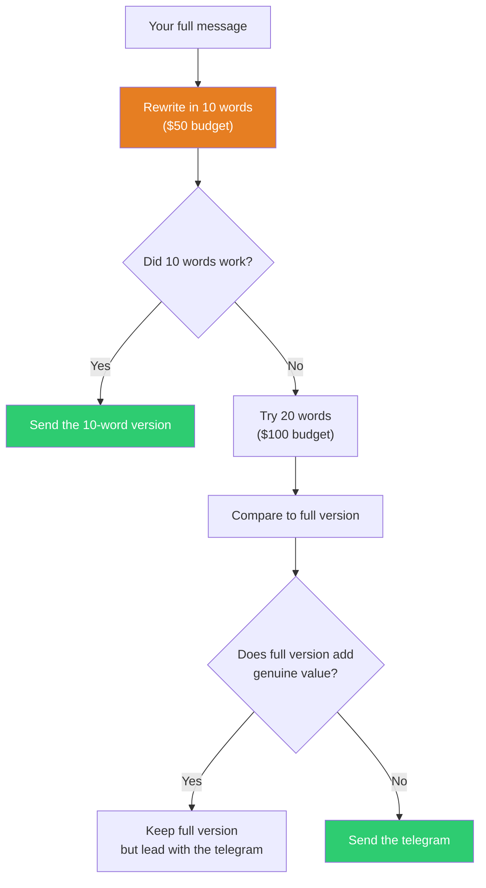

## The Move

Rewrite your entire message, explanation, or proposal as if each word costs $5. Your budget is $50 — that's 10 words. Can you say it in 10 words? If not, try $100 (20 words). The version you'd pay for with real money is the version that matters. Everything else is padding you added because words are free.

Now compare your telegram to your full output. Is the full version actually better or just longer? If the telegram says the same thing, send the telegram. If the full version adds genuine value beyond the telegram, keep it — but put the telegram first as your opening line.

## When to Use

- Before sending any message longer than 3 sentences
- When writing commit messages, PR titles, or ticket summaries
- When you realize your "quick update" has become an essay
- Before presenting to someone with limited time or attention
- When an AI agent's response needs to be distilled for human consumption

## Diagram

## Example

**Situation:** A developer writes a Slack message to the team:

> "Hey team, I wanted to give a heads up that I've been looking into the performance issues we've been seeing in the dashboard loading times. After profiling the main dashboard endpoint, I found that the issue is primarily caused by an N+1 query in the widget loader — it's making a separate database call for each widget on the dashboard, and some users have 30+ widgets. I've got a fix ready that uses eager loading to batch the queries. In my local testing it brings the dashboard load time from ~4 seconds down to ~400ms. I'll have a PR up this afternoon for review."

**The telegram ($50 / 10 words):** "Dashboard slow: N+1 query. Fix ready. 4s to 400ms."

**The $100 version (20 words):** "Dashboard slow due to N+1 in widget loader. Fix uses eager loading: 4s to 400ms. PR today."

**Comparison:** The 20-word version contains everything the team needs to know. The original 100-word version adds the investigation narrative ("I've been looking into... after profiling...") which is process, not information. Lead with the telegram, add detail only if asked.

## Watch Out For

- The telegram is a test, not always the final output. Some messages genuinely need detail — architecture decisions, incident postmortems, onboarding docs. The test is whether YOU know what the 10-word version is before you write the 100-word version
- Don't sacrifice precision for brevity. "Fix the bug" is short but useless. "N+1 in widget loader" is short AND actionable. Compression should increase information density, not destroy it
- This move is hardest for people who think in paragraphs. If that's you, write the paragraph first, then extract the telegram. You're allowed to think verbosely and communicate concisely
- Watch for the trap of over-compression in high-stakes communication. A 10-word incident report is negligent. A 10-word status update is efficient. Match the compression to the stakes
