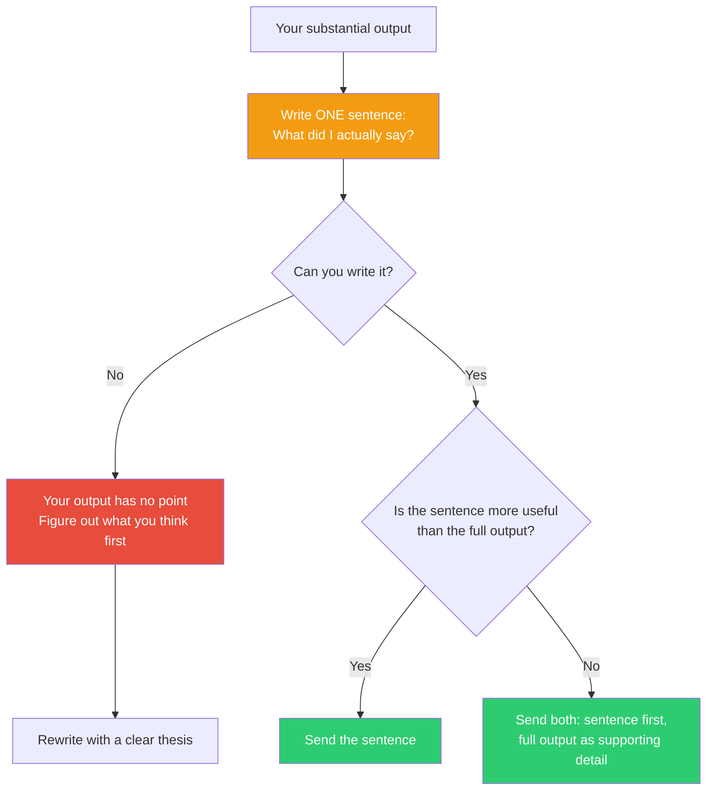

## The Move

You just produced something substantial — a long explanation, a detailed plan, a thorough analysis, a multi-paragraph message. Now: write ONE SENTENCE summarizing what you actually said. Not what you covered, not what topics you touched — what you SAID. What is the claim, the recommendation, the conclusion?

If that one sentence is more useful to the reader than your full output, just send the sentence. If you can't write the sentence at all, your output doesn't have a point — it's motion without direction. Go back and figure out what you actually think before producing more words. The one-sentence test separates "I have something to say" from "I have a lot to say about nothing."

## When to Use

- After writing any output longer than 5 sentences — before hitting send
- When reviewing your own design docs, proposals, or technical specs
- When an AI agent produces a long response and you need to check if there's substance
- After a brainstorming session, to check if the session produced a conclusion or just activity
- When you suspect you're adding length because you're uncertain, not because you have more to say

## Diagram

## Example

**Situation:** An engineer writes a 500-word analysis of whether to use GraphQL or REST for a new API:

> (Covers history of both, pros/cons of each, team experience, client needs, performance characteristics, tooling ecosystem, learning curve, maintenance burden, flexibility for future changes, and caching strategies.)

**The one-sentence test:** She tries to write one sentence summarizing what she actually said.

**First attempt:** "GraphQL and REST both have tradeoffs." That's a topic, not a claim. She didn't actually SAY anything.

**Second attempt:** "We should use REST because our team knows it, our clients are simple CRUD consumers, and the 3 weeks of GraphQL ramp-up time would delay the launch with no compensating benefit for this use case."

**The realization:** The 500-word analysis was exploring, not concluding. She was writing to think. The second attempt — one sentence — is the actual output. The 500 words can become an appendix for anyone who wants the reasoning. But the sentence is the deliverable.

**Final output:** She sends the one sentence as her recommendation, with a link to the full analysis for those who want depth. The decision gets made in the meeting instead of being deferred for "more discussion."

## Watch Out For

- "I can't write one sentence" is not a failure of compression — it's a signal that you haven't finished thinking. That's valuable information. Don't force a premature summary; instead, recognize that you need more thinking time, not more writing time
- The sentence should be a CLAIM or RECOMMENDATION, not a summary of topics. "I discussed caching strategies" is a table of contents entry. "We should cache at the CDN layer because our data changes hourly, not per-request" is a sentence worth sending
- Some outputs genuinely don't have a single thesis — exploration logs, brainstorm dumps, research notes. For those, the one-sentence test still works: "I don't have a conclusion yet — here are the three most promising directions." That's honest and useful
- Don't let this move prevent you from writing long-form when long-form is needed. The test is whether you can ALSO say it short. If you can't say it short, the long version probably isn't saying it either
