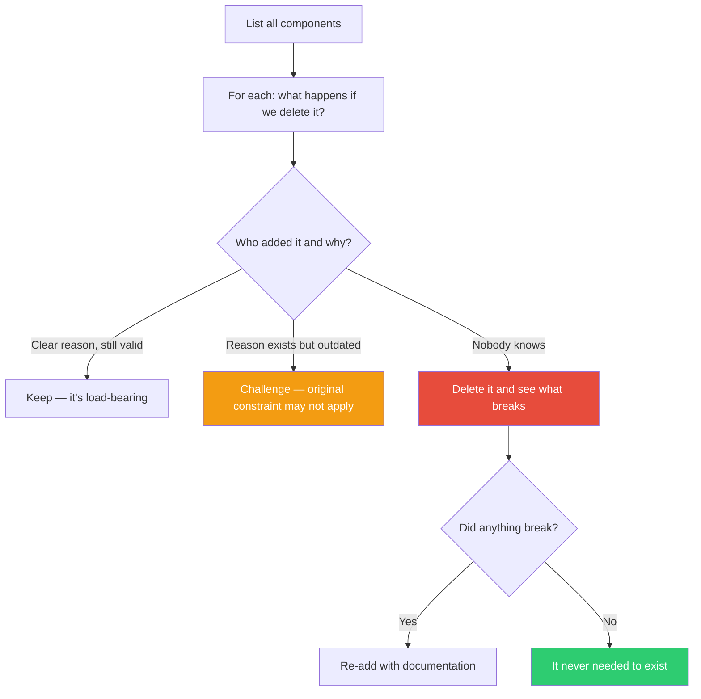

## The Move

List every component, requirement, process, meeting, or feature in the system you're evaluating. For each one, ask: **"What happens if we delete this entirely?"** Not deprecate. Not simplify. Delete. Then ask: **"Who added this, when, and why?"** If nobody can answer — if the reason is lost, or the person who added it is gone, or the original constraint no longer applies — that's your strongest signal. The Musk battery protector story: engineers spent months optimizing a component until someone asked why it existed. Nobody knew. They removed it. The rocket worked fine. Now ask: what would {{persona.1}} question first if they walked in with fresh eyes?

## When to Use

- You're about to optimize something and haven't asked if it should exist
- The system has grown organically and nobody has done a full existential audit
- A component, process, or requirement has been there "forever" and is treated as given
- You inherited a system and are adding to it without questioning the foundation
- Complexity keeps growing and nobody can explain the full architecture

## Diagram

## Example

**Situation:** A SaaS platform has a nightly "data reconciliation job" that runs for 3 hours and everyone treats as sacred. The team is asked to optimize it because it's hitting the maintenance window.

**The move:** Instead of optimizing, ask: "What happens if we turn it off?"

Investigation reveals: the job was added 4 years ago when the billing system and the product database could get out of sync due to a race condition. That race condition was fixed 2 years ago in a database migration. The reconciliation job has been finding zero discrepancies for 18 months. Nobody checked because the job "always ran" and was in the runbook.

**Result:** Delete the job entirely. Save 3 hours of compute nightly, eliminate a maintenance window constraint, and remove a source of false-alarm pages. The 3 months someone was about to spend "optimizing" it become available for actual work.

## Watch Out For

- This move requires courage — deleting things that "have always been there" makes people nervous. But nervous is not the same as wrong
- Some components ARE load-bearing even if nobody can explain why. If you can't safely test deletion (e.g., in production), test in staging or use feature flags
- The social version of this is harder: "Does this meeting need to exist?" "Does this approval process need to exist?" Same logic applies, higher political cost
- Don't confuse "I don't understand why it's here" with "it doesn't need to be here." Do the investigation before deleting. But also don't confuse "it's always been here" with "it needs to be here"
