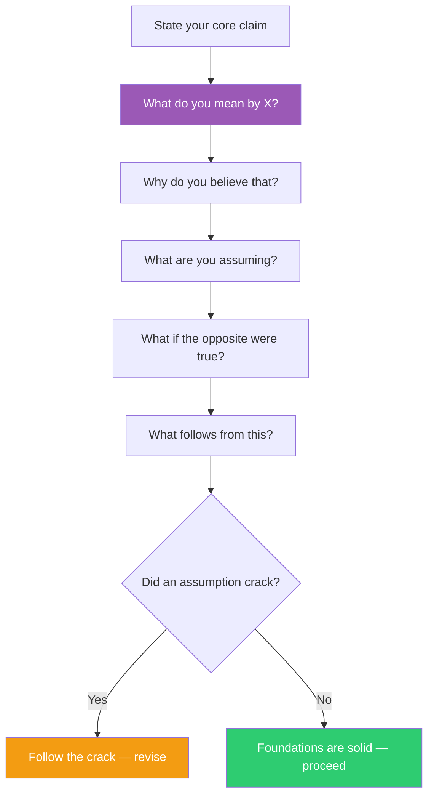

## The Move

Pick your core claim — the thing you believe or the approach you've chosen. Now become the questioner, not the advocate. Ask these five questions in sequence, and answer each honestly before moving to the next:

1. **What do you mean by X?** (Clarification) — Define the key term in your claim. Not the dictionary definition — what do YOU mean, here, now?
2. **Why do you believe that?** (Evidence) — What's the actual evidence, not the story you tell yourself?
3. **What are you assuming?** (Assumptions) — What must be true for your reasoning to hold? Name at least three assumptions.
4. **What if the opposite were true?** (Counter-position) — Not as an attack, but as genuine inquiry. What world would make the opposite the right answer?
5. **What follows from this?** (Implications) — If you're right, what else must be true that you haven't checked?

The key: the questioner has NO position. They are not arguing against you. They are helping you discover what you actually think, which may be different from what you think you think.

For agents: spawn a subagent whose ONLY job is to ask these five questions. It must not offer opinions, alternatives, or judgments. Pure questions. The answering agent will surface its own assumptions faster than any adversarial attack could extract them.

## When to Use

- Before committing to an architecture, strategy, or design — test the foundations, not the conclusion
- When a team has consensus but nobody can trace the reasoning back to first principles
- When you notice you're defending a position rather than examining it
- When the answer came fast and felt obvious — that's when unexamined assumptions are most dangerous
- When you want to understand a problem deeply before solving it (planning mode)

## Diagram

## Example

**Claim:** "We should use a message queue between the API and the processing pipeline."

**Socratic sequence:**

1. **What do you mean by 'should'?** "It's the right architecture for decoupling these services." **What do you mean by 'decoupling'?** "They can evolve independently. We can deploy one without the other."
2. **Why do you believe they need to evolve independently?** "Because... the processing pipeline changes more often." **How often?** "Well, last quarter it changed twice. The API changed three times."
3. **What are you assuming?** (a) That the queue won't introduce its own coupling (schema contracts, ordering guarantees). (b) That the team knows how to debug distributed async failures. (c) That the latency added by the queue is acceptable.
4. **What if the opposite were true — what if tight coupling were better here?** "If they always deploy together anyway, and the team is small, a direct function call is simpler, faster, and debuggable with a stack trace instead of a dead letter queue."
5. **What follows?** "If the queue IS right, we need schema versioning, monitoring, DLQ handling, and someone on-call who understands async failure modes. Have we budgeted for that?"

**Outcome:** The assumption that cracked was (b) — the team has no distributed systems experience. The queue might still be right, but now the decision includes the operational cost, not just the architectural elegance.

## Watch Out For

- The questioner must not smuggle in opinions. "Don't you think that's risky?" is not Socratic — it's leading. "What would make that risky?" is Socratic
- Five questions is a starting framework, not a rigid script. Follow the thread that produces discomfort — that's where the assumption lives
- This move is slow and uncomfortable. That's the point. Fast answers to Socratic questions mean you're performing confidence, not examining beliefs
- Socratic questioning works on YOUR OWN claims, not just other people's. The hardest and most valuable application is self-examination
