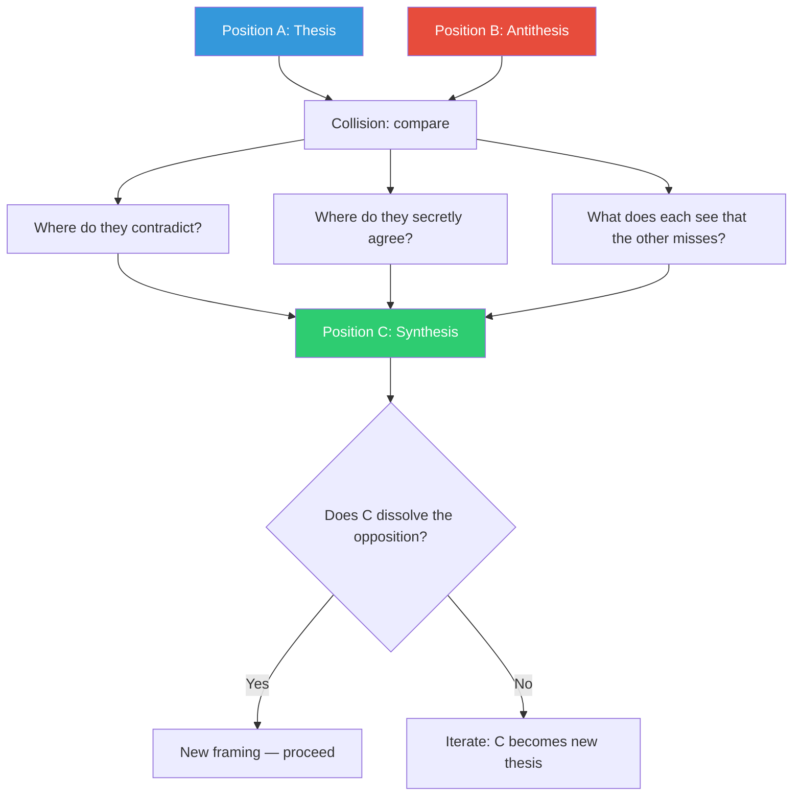

## The Move

You have a position — or two competing options. Run this protocol:

**Round 1: Thesis.** State Position A in its strongest form. Argue for it as if you were {{persona.1}}. Name its core principle, its best evidence, and the world in which it is obviously correct.

**Round 2: Antithesis.** State Position B — the genuine opposite, not a straw man. Argue for it as if you were {{persona.2}}. Name where it is stronger than A. Name what A cannot see.

**Round 3: Collision.** Put them side by side. Where do they actually contradict? (Often less than you think.) Where do they agree but in different language? What does each position correctly diagnose that the other misses?

**Round 4: Synthesis.** Build Position C — the thing that preserves the core insight of BOTH positions while resolving the contradiction. C is not a compromise (splitting the difference). C is a reframing that makes the original opposition dissolve.

For agents: spawn two subagents with opposing briefs. Give each 3 rounds to make their strongest case. The parent agent reads both transcripts and performs the synthesis. The subagents cannot see each other — they argue independently, which prevents convergence too early.

## When to Use

- Two legitimate options are deadlocked and the debate produces heat, not light
- You're choosing between approaches and neither feels complete
- A design decision has split the team and "compromise" would give you the worst of both worlds
- You suspect the right answer transcends the current framing

## Diagram

## Example

**Thesis:** "We should build a comprehensive type system with branded types, discriminated unions, and strict null checks everywhere. Type safety prevents bugs at compile time."

**Antithesis:** "We should keep types minimal — interfaces at boundaries, `any` internally where it speeds development. The type system is a tool, not a goal. We're a startup; shipping speed matters more than compile-time guarantees."

**Collision:**
- They contradict on: how much type ceremony is worth the cost
- They secretly agree on: types at system boundaries are non-negotiable
- Thesis sees: the bugs that slip through loose typing cost more than the time saved
- Antithesis sees: the type gymnastics slow the team and the branded types are used by one person who enjoys them

**Synthesis:** Strict types at every system boundary (APIs, database queries, external services) — these are non-negotiable and catch the expensive bugs. Internal module code uses simple types with inference — no branded types, no discriminated unions unless the domain demands them. The rule: "strict at the edges, pragmatic in the middle." This preserves the safety insight of the thesis and the velocity insight of the antithesis. The original debate ("strict vs. loose") dissolves into a spatial question ("where?").

## Watch Out For

- Synthesis is NOT compromise. "Let's do a little of both" is the death of this move. C must be a genuine reframing, not a dilution
- If you can't find a real synthesis, that's information — sometimes A and B are genuinely incompatible and you must choose. The protocol still helps by making the choice explicit and well-understood
- The subagents (or the two sides of your thinking) must genuinely try to win. Polite disagreement produces polite mush. Assign strong personas to each side
- Beware premature synthesis. Rounds 1-3 should feel uncomfortable. If the synthesis comes too easily, you haven't pushed the positions hard enough
