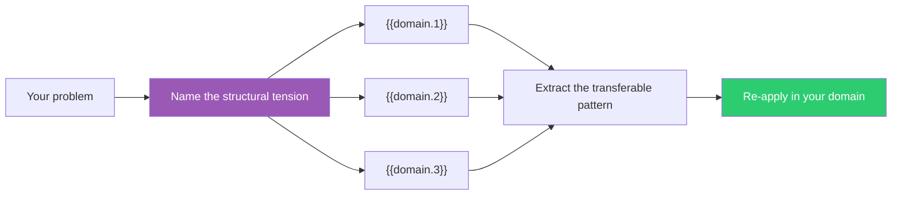

## The Move

Your problem has a structural tension — two things that both need to be true, a trade-off that seems inescapable, a constraint that won't budge.

Now: how would someone in **{{domain.1}}** resolve a similar tension? What about **{{domain.2}}**? Or **{{domain.3}}**?

Don't look for surface resemblance. Look for the same *shape* — the same underlying trade-off — solved with a pattern you'd never encounter in your own field. Name the structural tension first, then ask how each domain handles that exact tension.

## When to Use

- You've exhausted the conventional approaches within your domain
- Everyone you consult suggests minor variations of the same idea
- The problem has a structural tension that won't resolve with more effort
- You need a genuinely novel approach, not a better version of the existing one

## Diagram

## Example

**Problem:** "How do we maintain code quality as the team scales from 5 to 50?"

**Structural tension:** Growth vs. consistency.

**{{domain.1}} lens:** In restaurant franchising, McDonald's doesn't train every cook to be a chef. They build consistency into the *system* — standardized processes, limited menus, quality checks at specific points. **Transferable pattern:** Make quality a property of the system, not individual skill. → Strict linting, automated architecture tests, golden path tooling.

**{{domain.2}} lens:** In immunology, the body doesn't prevent every pathogen at the border. It has layered defenses — skin, innate immunity, adaptive immunity — each catching what the previous layer missed. **Transferable pattern:** Layer your defenses so each can be imperfect. → Types catch one class of bugs, tests catch another, monitoring catches what shipped.

**{{domain.3}} lens:** What does this domain do with the same tension? Name the pattern, then translate it.

## Watch Out For

- Analogies are seductive. The structural similarity must be real, not just poetic. "Our codebase is like a garden" is a metaphor, not a transferable pattern — unless you can name the specific gardening technique and how it concretely applies
- If none of the three domains spark anything, re-roll the variables — don't force a bad analogy
- The value is in the *pattern*, not the *story*. Once you've extracted it, drop the analogy and evaluate the solution on its own merits
