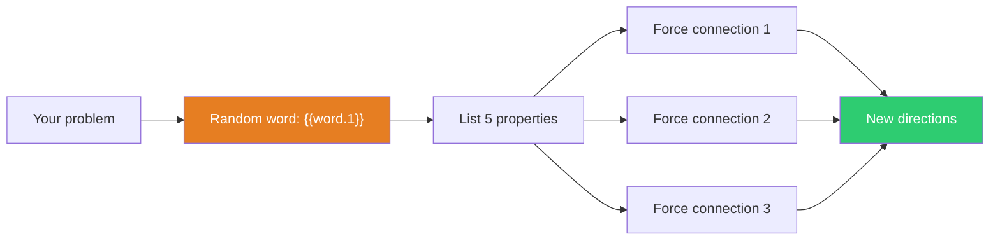

## The Move

Write down your problem in one sentence. Now look at the word **{{word.1}}**. List five concrete properties of that thing — what it looks like, how it works, what it does, where you find it. For each property, force a connection back to your problem: "What if our solution had this property?"

You are not looking for the *right* connection. You are using randomness to break fixation. Your pattern-matching brain will do the rest — it cannot help but find links, even where none were intended.

## When to Use

- You keep generating the same three ideas in different disguises
- The problem feels stale and over-analyzed
- You want a quick creative jolt, not a deep session
- You're stuck and willing to try something that feels silly

## Diagram

## Example

**Problem:** "Our API error messages are confusing and users keep filing support tickets about the same issues."

**Random word:** *lantern*

**Properties of a lantern:**
1. Emits light in all directions
2. Has a handle for carrying
3. Runs on a finite fuel source
4. Visible from a distance
5. Creates a warm glow, not a harsh beam

**Forced connections:**
- "Emits in all directions" — What if error messages radiated context? Instead of one terse message, show the error, the likely cause, and the next step simultaneously.
- "Has a handle" — What if every error message had a portable, graspable identifier? A short error code users can carry to the docs or paste into search.
- "Visible from a distance" — What if we surfaced error patterns in a dashboard so the *team* can see recurring issues before users file tickets?

The third connection reframes the problem from "better error messages" to "better error visibility" — a direction that wasn't in the original brainstorm.

## Watch Out For

- Don't reject connections because they feel forced — that's the point. The value is in the detour, not the destination
- Spend at most 5 minutes. If nothing sparks, re-roll the word and try again
- This is a *starting* move. It generates raw directions, not finished solutions. Follow up with evaluation
- If you find yourself explaining *why* the random word is actually deeply related to your problem, you're storytelling, not designing. Extract the idea and drop the word
