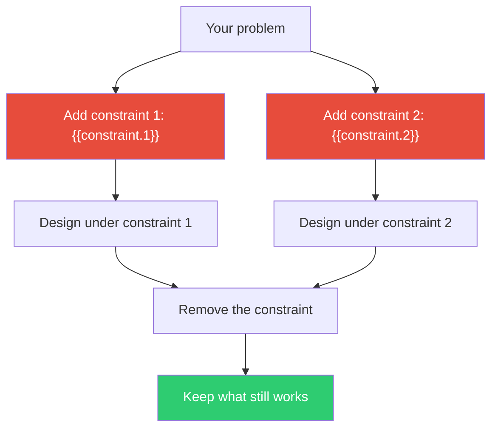

## The Move

State your problem. Now artificially impose a constraint that isn't actually required: **{{constraint.1}}**. Design a solution under that constraint. Then try a second: **{{constraint.2}}**. Design again.

The constraint isn't the point — the *detour* is. When the obvious path is blocked, you're forced down side roads. Some of those side roads turn out to be better than the main road, even after you remove the constraint.

## When to Use

- The solution space is so open that every option looks equally mediocre
- You keep gravitating toward the same safe, incremental approach
- You want to discover non-obvious designs without needing a flash of inspiration
- Early exploration phase where you want to generate structurally different alternatives

## Diagram

## Example

**Problem:** "Design a better onboarding experience for our developer tool."

**Constraint 1:** *"It must be explainable in one sentence."*
This forces you to strip the onboarding to its absolute core. You realize the current flow has 8 steps because the product has 8 features, not because the user needs 8 things on day one. The constrained design: "Run this one command, see your first result." Even after removing the constraint, this insight survives — lead with one outcome, not a tour.

**Constraint 2:** *"A child must be able to operate it."*
Now you can't rely on users reading documentation or knowing terminal conventions. You design a visual, drag-and-drop setup wizard. After removing the constraint, you don't ship the children's version — but you do notice that the wizard approach eliminated three steps where users previously got stuck on config syntax.

Both constraints produced ideas the unconstrained brainstorm never reached.

## Watch Out For

- The constraint is a tool, not a requirement. Always remove it afterward and ask "what survives?"
- If a constraint produces nothing interesting, don't grind — re-roll and try a different one
- Don't pick constraints that are too close to your actual constraints. The value comes from *arbitrary* restrictions that force genuinely different paths
- Two constraints are enough. Adding more in a single session dilutes focus
