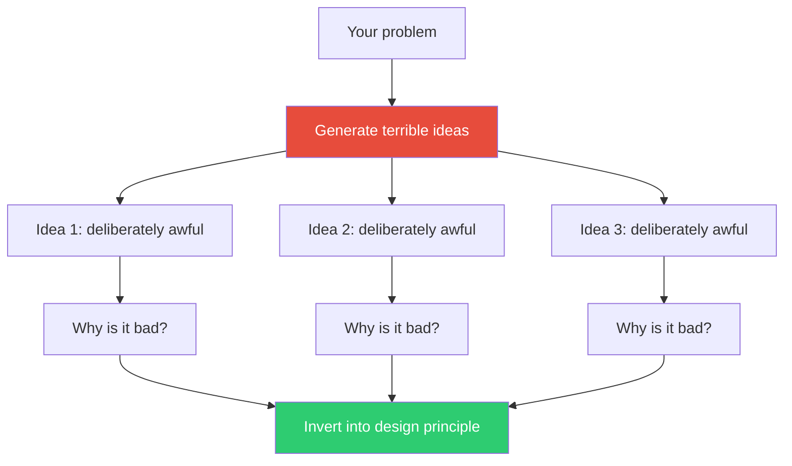

## The Move

Set a timer for 3 minutes. Generate your worst ideas with this additional constraint: {{constraint.1}}. Come up with as many deliberately terrible solutions as you can — the kind that would get you fired, bankrupt the company, or make users actively hostile. Be specific: not just "make it bad" but "charge users per keystroke" or "require a fax of your passport to log in."

Now examine each terrible idea. For each one, ask: *why exactly is this bad?* Write down the specific reason. Then invert that reason into a design principle. The terrible idea "charge per keystroke" is bad because it punishes engagement — invert it and you get "reward engagement," which is a real design direction.

## When to Use

- The room is stuck in "good idea" paralysis — everyone is filtering before speaking
- Brainstorming has gone stale and keeps producing the same cautious suggestions
- You want to discover hidden assumptions about what makes a solution "good"
- You need to break tension and energize a demoralized exploration session

## Diagram

## Example

**Problem:** "How do we reduce churn in our SaaS product?"

**Terrible ideas:**
1. Delete the user's data if they don't log in for 3 days
2. Make the cancellation flow 47 steps long
3. Send 20 emails per day begging them to come back
4. Lock their most-used feature behind an annual contract

**Inversions:**
1. *Why bad:* Punishes absence with irreversible loss. *Inverted:* Reward return with a visible record of what they've built. *Design principle:* Show accumulated value on login — "You have 340 saved analyses."
2. *Why bad:* Traps users through friction, breeds resentment. *Inverted:* Make cancellation easy but show what they'll lose. *Design principle:* The cancellation page becomes a personalized summary of value received.
3. *Why bad:* Volume without relevance is spam. *Inverted:* One perfectly timed, perfectly relevant message. *Design principle:* Trigger re-engagement based on the user's specific usage pattern, not a calendar.
4. *Why bad:* Coercion erodes trust. *Inverted:* Make the most-used feature so good they choose to stay. *Design principle:* Invest disproportionately in the features that correlate with retention.

Inversion 1 and 3 are concrete product ideas that never came up in the original brainstorm.

## Watch Out For

- The terrible ideas must be *specific*, not vaguely bad. "Make it worse" yields nothing. "Require users to solve a CAPTCHA every 30 seconds" yields something
- Don't skip the "why is it bad" step. The inversion is where the value lives, not the joke
- This is a quick move — 3 minutes generating, 5 minutes inverting. If you spend longer, you're overthinking it
- Some terrible ideas are actually just bold ideas in disguise. If a "worst idea" makes you pause and think "wait, what if...", follow that thread
