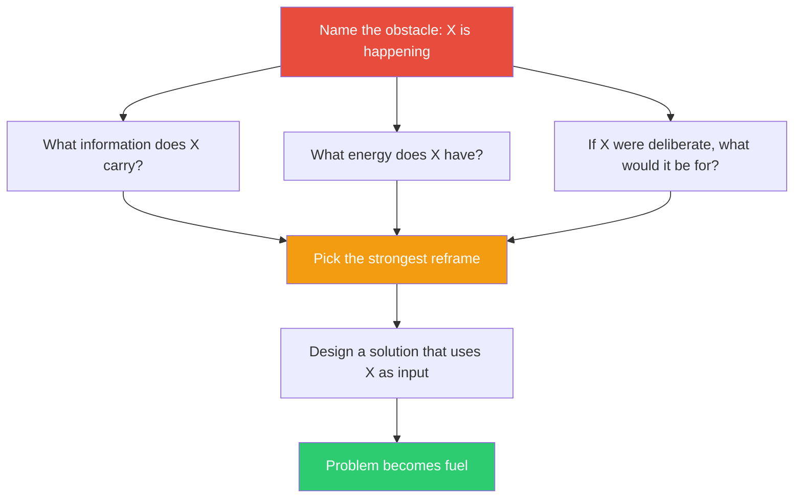

## The Move

Name the specific thing causing your problem. Write it down as a factual statement: "X is happening." Now reframe X as a resource by asking three questions. First: what information does X carry? (Every problem is also a signal.) Second: what energy or momentum does X have that you could redirect? Third: if you had deliberately designed X into your system, what would it be good for? What if the obstacle had the properties of {{word.1}}? Which properties make it useful? Pick the most promising reframe and design a solution that uses X as an input rather than treating it as an obstacle to eliminate.

## When to Use

- You've been fighting the same obstacle repeatedly and it keeps coming back
- An external force (user behavior, market condition, technical constraint) resists all your attempts to change it
- Your problem has built-in energy or volume that you're currently wasting by suppressing it
- You're stuck because every solution requires eliminating something you can't actually eliminate

## Diagram

## Example

**Problem:** "Users keep entering their data in the wrong format. We've added validation, tooltips, examples, and they still get it wrong 30% of the time."

**The obstacle:** Users enter data in the wrong format.

**Question 1 — What information does this carry?** The "wrong" formats show us what users actually think the data looks like. They're revealing their mental model.

**Question 2 — What energy does this have?** 30% of all submissions. That's a massive volume of signal we're currently throwing away with error messages.

**Question 3 — If this were deliberate, what would it be for?** It would be a free, continuous usability study showing us how users naturally express this data.

**The judo move:** Stop validating and rejecting. Instead, accept every format users enter and build a parser that handles the top 10 "wrong" formats. Log the ones you can't parse to discover new formats to support. The error rate drops to near zero — not because users changed, but because the system learned to meet them where they are.

**What shifted:** The team stopped seeing user input as a problem to correct and started seeing it as a spec for what the system should accept.

## Watch Out For

- Not every problem is a hidden resource. Sometimes a crash is just a crash and you need to fix the bug. Apply this move when you're fighting a recurring, structural obstacle — not one-off failures
- The reframe has to produce a concrete design change, not just a philosophical shift. "Embrace the chaos" is not a solution. "Route the chaos into a logging pipeline that feeds a classifier" is
- This move can take time to land. The three questions often produce nothing on the first pass. Sit with them. The best reframes tend to arrive after you've explored several bad ones
- Be honest about whether you're using the problem or just rationalizing inaction. The test: does your new design actively exploit the obstacle, or does it just tolerate it?
