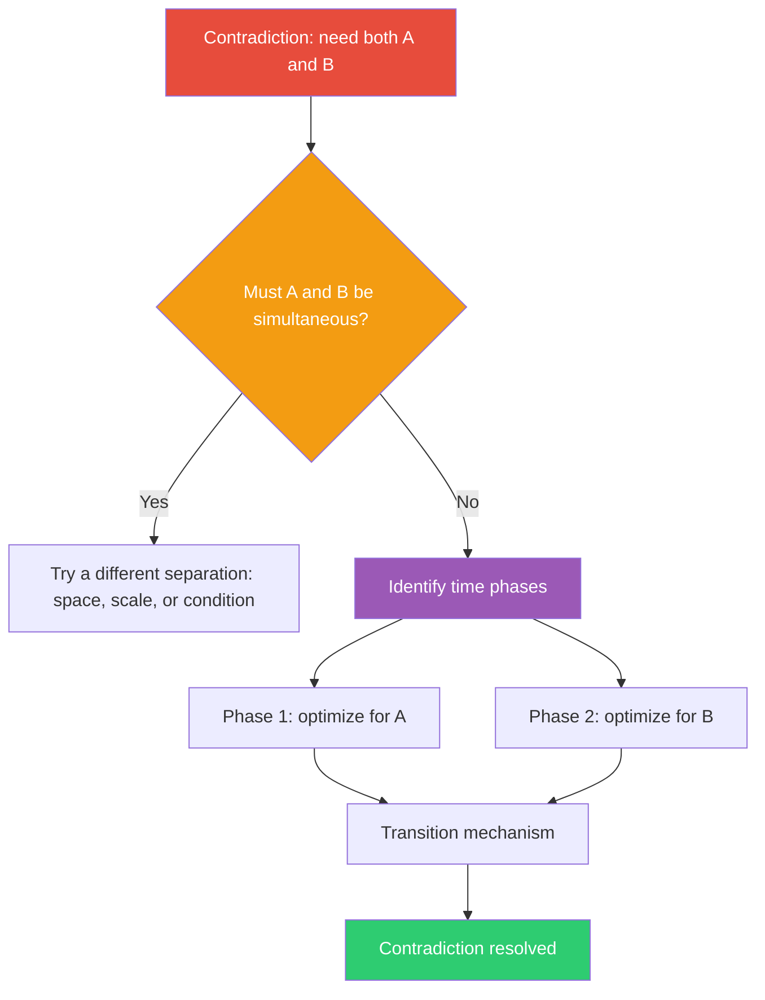

## The Move

State the contradiction explicitly: "We need the system to be A, but we also need it to be B, and A conflicts with B." Now ask: do A and B actually need to be true at the same moment? Identify distinct time phases in your system — setup vs. runtime, ingestion vs. query, pre-launch vs. post-launch, peak hours vs. off-peak, write path vs. read path. Phase 1 happens at {{timeframe.1}}, phase 2 at {{timeframe.2}}. Assign each conflicting requirement to the phase where it matters most. Design a transition mechanism between phases. The conflict dissolves because A and B never coexist.

## When to Use

- Two requirements seem logically contradictory and every design tries to compromise between them
- You need a system to have two incompatible properties (fast and thorough, flexible and stable, open and secure)
- You're stuck because optimizing for one goal degrades the other
- The problem has natural phases or modes that you haven't yet exploited

## Diagram

## Example

**Problem:** "Our search index needs to be always-available for queries (fast reads, no downtime) AND periodically rebuilt from scratch to incorporate new ranking algorithms (slow, resource-intensive, causes inconsistency during rebuild)."

**The contradiction:** Available and consistent vs. rebuildable and improvable.

**Do they need to be simultaneous?** No. Users need fast queries during business hours. Rebuilds can happen on a different schedule.

**Separate in time:**
- **Phase 1 (serving):** A read-only, optimized index serves all queries. No writes, no rebuilds. Maximum speed and availability.
- **Phase 2 (building):** A background process builds a completely new index from scratch using the latest algorithm. Takes as long as it needs. No user impact.
- **Transition:** When the new index is ready, swap it in atomically. The old index stays available until the swap completes. If the new index has issues, swap back.

**Result:** This is exactly how Elasticsearch rolling restarts and Solr's core swaps work. The pattern appears everywhere: blue-green deployments, double-buffering in graphics, database read replicas. The same insight — separate the conflicting needs into different time phases.

## Watch Out For

- The transition between phases is where bugs live. Design the handoff carefully — what happens to in-flight work when you switch phases?
- Not all contradictions are temporal. If both requirements genuinely must hold at every moment, you need a different separation (in space, by condition, or by scale). Don't force a temporal split where it doesn't fit
- Phasing adds operational complexity. You now have two modes to test, monitor, and debug instead of one. Make sure the contradiction is real before adding this machinery
- Check whether the phases can drift. If Phase 1 gets longer and Phase 2 gets squeezed, the separation breaks down
